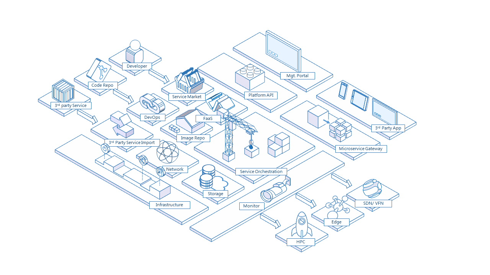

# Board
[](https://goreportcard.com/report/github.com/inspursoft/board) [](https://travis-ci.org/inspursoft/board) [](https://codecov.io/gh/inspursoft/board)

[English](README.md) | [中文](README_zh_CN.md)

**Note**: The `master` branch may be in an *unstable or even broken state* during development.
Please use [releases] instead of the `master` branch in order to get stable binaries.

| Community Meeting |
| ------------------------------------------------------------ |
| The Board Project holds monthly community calls on Zoom . To join the communit calls or to watch previous meeting notes and recordings, please visit the [meeting schedule](https://github.com/inspursoft/board/wiki/community-meeting-schedule). |


The "Board" product is a container service platform based on docker + kubernetes, provide cloud solutions for Inspur software group, including lightweight container virtualization, micro service, DevOps, continuous delivery, help enterprises and development teams achieve fast business application delivery and continuous innovation.

## Features
* **User Account**: Board supports databse authentication modes and support LDAP mode.
* **Project Based Access Control**: Board manages services through projects on container service platform. Users can be added into system as a member with different roles.
* **Manage Projects**: A project in Board contains all services, images etc.
* **Manage Services**: Board supports creating container service. All services must be grouped by projects.
* **Searching**: Board search engine could search project, service, users and image.
* **Monitoring Dashboard**: Monitoring Dashboard collect logs from k8s master and nodes. It cover the machine indicators, such as cpu, memory usage, file system and k8s services runtime.
* **Administrator Options**: Administrator options provide user management which can add, change or remove user by an admin user.



## Install

**System requirements:**
Board is deployed as several Docker containers, and, therefore, can be deployed on any Linux distribution that supports Docker. The target host requires Python, Docker, and Docker Compose to be installed.  
* Python should be version 2.7 or higher.  Note that you may have to install Python on Linux distributions (Gentoo, Arch) that do not come with a Python interpreter installed by default  
* Docker engine should be version 1.11.2 or higher.  For installation instructions, please refer to: https://docs.docker.com/engine/installation/
* Docker Compose needs to be version 1.7.1 or higher.  For installation instructions, please refer to: https://docs.docker.com/compose/install/

### Install
The installation steps boil down to the following

1. Download the installer;
2. Configure **board.cfg**;
3. Run **install.sh** to install and start Board;
Note: If you need prepare Kubernetes and Registry environment, please refer to the appendix part.


#### Downloading the installer:

The binary of the installer can be downloaded from the `release` page. Choose either online or offline installer. Use *tar* command to extract the package.

The difference between online installer and offline installer is:
* The online installation package directly pulls the image from dockerhub, the installer is very small in size.
* The offline installation package contains all the images needed for this project, so the installation package is quite larger

Online installer:
```sh
    $ tar xvf board-online-installer-VERSION[-ARCH].tgz
```
Offline installer:
```sh
    $ tar xvf board-offline-installer-VERSION[-ARCH].tgz
```

#### Configuring Board
Configuration parameters are located in the file **board.cfg**. 

There are two categories of parameters in board.cfg, **required parameters** and **optional parameters**.  

* **required parameters**: These parameters are required to be set in the configuration file. They will take effect if a user updates them in ```board.cfg``` and run the ```install.sh``` script to reinstall Board.
* **optional parameters**: These parameters are optional for updating. Subsequent update to these parameters in ```board.cfg``` will be ignored. 

The parameters are described below - note that at the very least, you will need to change the **hostname** attribute. 

##### Required parameters:

* **hostname**: The target host's hostname, which is used to access the UI and the apiserver service. It should be the IP address or the fully qualified domain name (FQDN) of your target machine, e.g., `192.168.1.10` or `reg.yourdomain.com`. _Do NOT use `localhost` or `127.0.0.1` for the hostname - the apiserver service needs to be accessible by external clients!_ 
* **db_password**: The root password for the MySQL database used for **db_auth**. _Change this password for any production use!_ 

##### Optional parameters

* **board_admin_password**: The administrator's initial password. This password only takes effect for the first time Board launches. After that, this setting is ignored and the administrator's password should be set in the UI. _Note that the default username/password are **boardadmin/123456a?** ._   
* **auth_mode**: The type of authentication that is used. By default, it is **db_auth**, i.e. the credentials are stored in a database. 
  For LDAP authentication, set this to **ldap_auth**.  

   **IMPORTANT:** When upgrading from an existing Board instance, you must make sure **auth_mode** is the same in ```board.cfg``` before launching the new version of Board. Otherwise, users may not be able to log in after the upgrade.
* **ldap_url**: The LDAP endpoint URL (e.g. `ldaps://ldap.mydomain.com`). Only used when **auth_mode** is set to *ldap_auth* .
* **ldap_searchdn**: The DN of a user who has the permission to search an LDAP/AD server (e.g. `uid=admin,ou=people,dc=mydomain,dc=com`).
* **ldap_search_pwd**: The password of the user specified by *ldap_searchdn*.
* **ldap_basedn**: The base DN to look up a user, e.g. `ou=people,dc=mydomain,dc=com`. Only used when **auth_mode** is set to *ldap_auth* .
* **ldap_filter**:The search filter for looking up a user, e.g. `(objectClass=person)`.
* **ldap_uid**: The attribute used to match a user during a LDAP search, it could be uid, cn, email or other attributes.
* **ldap_scope**: The scope to search for a user, LDAP_SCOPE_BASE, LDAP_SCOPE_ONELEVEL, LDAP_SCOPE_SUBTREE. Default is LDAP_SCOPE_SUBTREE. 
* **self_registration**: (**on** or **off**. Default is **on**) Enable / Disable the ability for a user to register himself/herself. When disabled, new users can only be created by the Admin user, only an admin user can create new users in Board. _NOTE_: When **auth_mode** is set to **ldap_auth**, self-registration feature is **always** disabled, and this flag is ignored.  
* **token_expiration**: The expiration time (in minutes) of a token created by token service, default is 30 minutes.

#### Connecting Kubernetes cluster which authentication strategy with CA certification
If the Kubernetes cluster which Board connect to authentication strategy with CA certification, you must copy the Kubernetes cluster's CA files to your machine which installing the Board. You should put CA files into /etc/board/cert directory and name them as 'ca-key.pem'(for private key) and 'ca.pem'(for public key).

You also need to deploy the following two files in your Kubernetes for Board to take over your Kubernetes cluster:
```sh
$ mkdir board-k8s-requires
$ cd board-k8s-requires
# board-clusterrolebinding.yaml
$ wget https://raw.githubusercontent.com/inspursoft/board-installer/main/ansible_k8s/roles/kubectlCMD/templates/board-clusterrolebinding.yaml
$ kubectl apply -f board-clusterrolebinding.yaml

# cadvisor.yaml
$ wget https://raw.githubusercontent.com/inspursoft/board-installer/main/ansible_k8s/roles/kubectlCMD/templates/cadvisor.yaml
# You need to replace the {{docker_dir}} placeholder in the file before deploying. The docker directory defaults to /var/lib/docker
$ kubectl apply -f cadvisor.yaml
```

In addition, there are some optional features:

**Helm Chart:** The chart museum is integrated in the Board, which depends on helm2
```sh
# tiller.yaml
$ wget https://raw.githubusercontent.com/inspursoft/board-installer/main/ansible_k8s/roles/kubectlCMD/templates/tiller.yaml
# tiller-service.yaml
$ wget https://raw.githubusercontent.com/inspursoft/board-installer/main/ansible_k8s/roles/kubectlCMD/templates/tiller-service.yaml
$ kubectl apply tiller.yaml
$ kubectl apply tiller-service.yaml
```

**EFK + Prometheus:** Board supports EFK+Prometheus log management
```sh
# fluentd.yaml
$ wget https://raw.githubusercontent.com/inspursoft/board-installer/main/ansible_k8s/roles/kubectlCMD/templates/fluentd.yaml
# Need to replace the {{board_ip_address}} {{docker_dir}} placeholder in the file before deploying
$ kubectl apply -f fluentd.yaml

# prometheus.yaml
$ wget https://raw.githubusercontent.com/inspursoft/board-installer/main/ansible_k8s/roles/kubectlCMD/templates/prometheus.yaml
# prometheus2.yaml
$ wget https://raw.githubusercontent.com/inspursoft/board-installer/main/ansible_k8s/roles/kubectlCMD/templates/prometheus2.yaml
# Need to replace the {{nfs_dir}} {{nsf_server_ip_address}} placeholder in the file before deploying, or replace this file with your own pv
$ kubectl apply -f prometheus.yaml
$ kubectl apply -f prometheus2.yaml
```

**Note:** If your kubernetes cluster is installed by the [inspursoft/board-installer](https://github.com/inspursoft/board-installer), you do not need to perform the above steps because the project’s automation script have been completed.

Then you should configure these items in **board.cfg**:

* **kube_http_scheme**: Set to 'https'. It means the requests Board send to Kubernetes cluster will be used via 'https' protocol.
* **kube_master_ip**: The IP address of the Master of Kubernetes cluster.
* **kube_master_port**: The port number of the Master of Kubernetes cluster(maybe 443 or 6443).

#### Finishing installation and starting Board
Once **board.cfg** is configured, install and start Board using the ```install.sh``` script.

##### Default installation

```sh
    $ sudo ./install.sh
```

#### After installation
If everything worked properly, you should be able to open a browser to visit the admin portal at **http://reg.yourdomain.com** (change *reg.yourdomain.com* to the hostname configured in your ```board.cfg```). Note that the default administrator username/password are boardadmin/123456a? .

Log in to the admin portal and create a new project, e.g. `myproject`. You can create your own service now.

For information on how to use Board, please refer to **[User Guide of Board](docs/user_guide.md)** .

For details on how to download and use the installation package, please refer to [Installation and Configuration Guide](docs/installation_guide.md).

## Upgrade

When upgrading your existing Board instance to a newer version, you may need  to migrate the data in your database. Refer to [change log](../tools/migration/changelog.md) to find out  whether there is any change in the database. If there is, you should go through the database migration process. Since the migration may alter the database schema, you should **always** backup your data before any migration.

*If your install Board for the first time, or the database version is the same as that of the latest version, you do not need any database migration.*

### Upgrading Board and migrating data
1 Log in to the host that Board runs on, stop and remove existing Board instance if it is still running:

   ```sh
   cd Deploy
   docker-compose down
   ```

2 Backup Board's current files so that you can roll back to the current version when it is neccessary.

   ```sh
   cd ..
   mv Deploy /my_backup_dir/Deploy
   mv /data/board /my_backup_dir/board
   ```

3 Get the latest Board release package from github:

   ```
   https://github.com/inspursoft/board
   ```

4 Before upgrading Board, perform database migration first. The migration tool is delivered as a Docker image, so you should build it yourself.

   ```sh
   git clone https://github.com/inspursoft/board.git
   cd board/tools/migration
   docker build -t board-migration .
   ```

5 You should start you current Board database by handy.

   ```sh
   docker run -d -p 3306:3306 -v /data/board/database:/var/lib/mysql -e DB_PASSWORD=root123 dev_db:dev
   ```

6 Backup database to a directory such as `/data/board-migration/backup`. You also need the IP address, port number,username and password to access the database are provided via environment variables "DB_IP", "DB_PORT", "DB_USR", "DB_PWD".

   ```sh
   docker run --rm -v /data/board-migration/backup:/board-migration/backup -e DB_IP=10.0.0.0 -e DB_PORT=3306 -e DB_USR=root -e DB_PWD=root123 board-migration backup
   ```
7 Upgrade database schema and migrate data.

   ```sh
   docker run --rm -v /data/board-migration/backup:/board-migration/backup -e DB_IP=10.0.0.0 -e DB_PORT=3306 -e DB_USR=root -e DB_PWD=root board-migration upgrade head
   ```

   **NOTE:**
   If you execute this command in a short while after starting the Board database, you may meet errors as the database is not ready for connection. Please retry it after waiting for a while.

### Roll back from an upgrade
For any reason, if you want to back to the previous version of Board, follow the below steps:

1 Stop and remove the current Board service if it is still running.

   ```sh
   cd Deploy
   docker-compose down
   ```

2 Start stand-alone container of Board database

   ```sh
   docker run -d -p 3306:3306 -v /data/board/database:/var/lib/mysql -e DB_PASSWORD=root123 dev_db:dev
   ```

3 Restore database from backup file in `/data/board-migration/backup`.

   ```sh
   docker run --rm -v /data/board-migration/backup:/board-migration/backup -e DB_IP=10.0.0.0 -e DB_PORT=3306 -e DB_USR=root -e DB_PWD=root123 board-migration restore
   ```

4 You should use the corresponding version of Board to start with it.

### Migration tool reference
Use `help` command to show instruction of migration tool:
`data/board-migration/backup`.

   ```sh
   docker run --rm -v /data/board-migration/backup:/board-migration/backup -e DB_IP=10.0.0.0 -e DB_PORT=3306 -e DB_USR=root -e DB_PWD=root123 board-migration help
   ```

For more details, please refer to [Upgrade And Database Migration Guide](docs/migration_guide.md).

## Run
For information on how to use BOARD, please take a look at [User Guide](docs/user_guide.md).

## Community
[Online Community Meeting](http://open.inspur.com/TechnologyCenter/board/wikis/Community%20meeting%20schedule)

[Online Community Meeting (inspur internal link)](http://10.10.5.9/TechnologyCenter/board/wikis/Community%20meeting%20schedule)

## Contribution
Board is developed in the open, and is constantly being improved by our **users, contributors, and maintainers**. It is because of you that we can bring great software to the community.

If you are interested in contributing to board projects, please read this [Contribution Guide Document](CONTRIBUTING.md). 

## License
Copyright (c) <2020> <inspur cloud service group>

Permission is hereby granted, free of charge, to any person obtaining a copy
of this software and associated documentation files (the "Board"), to deal
in the Software without restriction, including without limitation the rights
to use, copy, modify, merge, publish, distribute, sublicense, and/or sell
copies of the Software, and to permit persons to whom the Software is
furnished to do so, subject to the following conditions:

The above copyright notice and this permission notice shall be included in all
copies or substantial portions of the Software.

THE SOFTWARE IS PROVIDED "AS IS", WITHOUT WARRANTY OF ANY KIND, EXPRESS OR
IMPLIED, INCLUDING BUT NOT LIMITED TO THE WARRANTIES OF MERCHANTABILITY,
FITNESS FOR A PARTICULAR PURPOSE AND NONINFRINGEMENT. IN NO EVENT SHALL THE
AUTHORS OR COPYRIGHT HOLDERS BE LIABLE FOR ANY CLAIM, DAMAGES OR OTHER
LIABILITY, WHETHER IN AN ACTION OF CONTRACT, TORT OR OTHERWISE, ARISING FROM,
OUT OF OR IN CONNECTION WITH THE SOFTWARE OR THE USE OR OTHER DEALINGS IN THE
SOFTWARE.

## Partners
Shanxi Provincial Department of Land and Resources

China Mobile Communications Group Co.,Ltd

Ministry of Veterans Affairs of the People's Republic of China

etc.

## Users
...(Coming soon.)

## Supporting Technologies
...(Coming soon.)

## About
...(Coming soon.)
