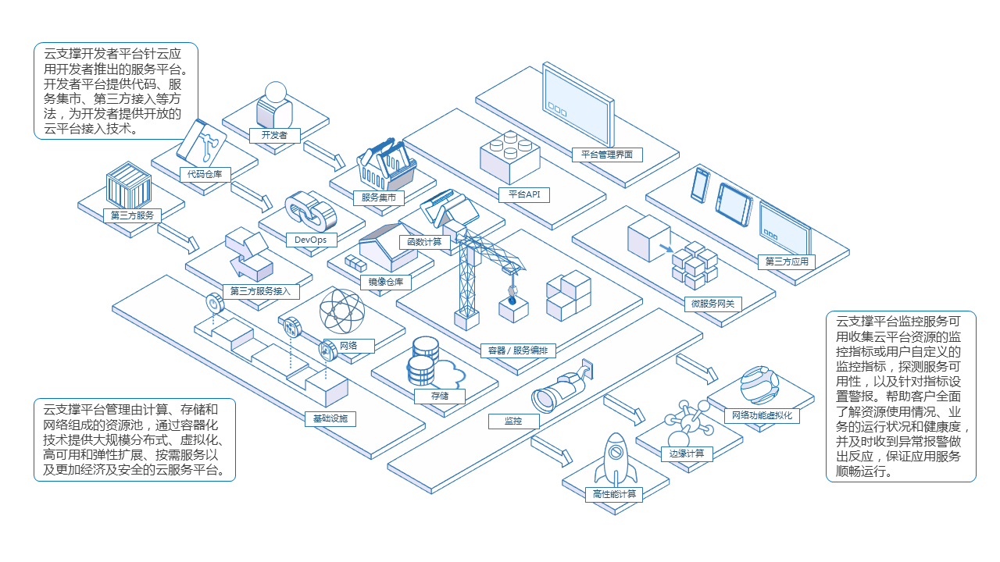

# Board

[English](README.md) | [中文](README_zh_CN.md)

**注意**：开发过程中，`master`分支可能处于*不稳定的甚至中断的状态*。
请使用`releases`分支，而不是`master`的分支，来获得稳定的二进制文件。

|沟通会议|
|------------------|
|Board项目使用Webex会议进行沟通。如果想加入沟通会议或者查看之前的会议记录, 请访问Wiki [meeting schedule](http://10.10.5.9/TechnologyCenter/board/wikis/community-meeting-schedule).|


"Board"产品是基于docker+ kubernetes的容器服务平台，为浪潮软件提供云解决方案，包括轻量级容器的虚拟化，微服务，DevOps，持续的交付，帮助企业和开发团队实现快速的业务应用交付和不断创新。

## 特性
* **用户账户**：Board支持数据库的认证方式和LDAP模式。
* **基于项目的访问控制**：通过容器服务平台上的项目管理服务，用户可作为不同角色的成员添加到系统中。
* **管理项目**：一个项目包含所有的服务，图片等。
* **管理服务**：Board支持创建容器服务。所有服务必须按项目分组。
* **查询**：Board搜索引擎可以搜索项目、服务、用户和镜像。
* **监控仪表板**：监视仪表板从k8s主节点和节点收集日志，它涵盖了机器指标，如CPU、内存使用、文件系统和k8s服务运行时。
* **管理员选项**：管理员选项提供用户管理，可由管理员用户添加、更改或删除用户。
* 



## 安装
**系统要求：**
Board作为几个Docker容器部署，因此，Board可以部署在任何支持Docker的Linux发行版。
* Python的版本应为2.7或更高。请注意，您可能需要对不附带默认安装Python解释器的Linux发行版（Gentoo，ARCH）安装Python。
* Docker engine的版本应为1.11.2或更高。有关安装说明，请参考：https://docs.docker.com/engine/installation/
* Docker Compose的版本应为1.7.1或更高。有关安装说明，请参考：https://docs.docker.com/compose/install/

### 安装
安装步骤如下

1. 下载安装程序；
2. 配置**board.cfg**；
3. 运行**install.sh**安装，然后启动Board；

**注意**：如果你需要准备Kubernetes和注册表环境，请参阅附录部分。

#### 下载安装程序
安装程序的二进制文件可以从`release`页面下载，选择在线或离线安装程序，使用*tar*命令提取包。

在线安装与离线安装的区别为：
* 在线安装包直接从dockerhub上拉取镜像，安装包较小
* 离线安装包内包含了本项目所需的所有镜像，安装包较大

在线安装程序:
```sh
    $ tar xvf board-online-installer-VERSION[-ARCH].tgz
```
离线安装程序:
```sh
    $ tar xvf board-offline-installer-VERSION[-ARCH].tgz
```

**如果您只想做一个快速预览，您可以按照这个的教程进行操作: [Quick start with kind](./docs/quick_start_with_kind.md)**

#### 配置Board
配置参数所在文件为**board.cfg**。

board.cfg中有两种类型的参数，**所需的参数**和**可选参数**。

* **所需的参数**：这些参数需要在配置文件中设置。他们将在用户更新```board.cfg```，并运行```install.sh```脚本重新安装Board后生效。
* **可选参数**：这些参数是可选的更新。后续更新这些参数```board.cfg```将被忽略。

参数说明如下 - 请注意，至少，你需要更改**hostname**属性。

##### 所需的参数
* **hostname**：目标主机的主机名，这是用来访问用户界面和API服务器服务。它应该是IP地址或者目标机器的完全限定域名（FQDN），例如，`192.168.1.10`或`reg.yourdomain.com`。 _不要使用`localhost`或`127.0.0.1`作为主机名 - 该API服务器服务需要由外部客户端访问！_
* **db_password**：MySQL数据库root密码用于**db_auth** 。 _任何生产使用请修改该密码！_

##### 可选参数
* **board_admin_password**：管理员的初始密码。这个密码只在Board第一次发布的时候生效。在此之后，该设置将被忽略，管理员的密码应该在用户界面进行设置。 _注意，默认的用户名/密码是**boardadmin/ 123456a?**。_
* **auth_mode**：所使用的身份验证的类型。默认情况下，它是**db_auth** ，即证书存储在数据库中。
对于LDAP身份验证，将其设置为**ldap_auth**

**重要:** 当从现有的Board实例升级，则必须确保在发布Board的新版本之前，```board.cfg```中**auth_mode**是相同的。否则，用户可能无法在升级后登录。

* **ldap_url**：LDAP端点URL(例如 `ldaps://ldap.mydomain.com`)。只在**auth_mode**设置为*ldap_auth*时使用。
* **ldap_searchdn**：有权搜索LDAP/AD服务器的的用户的DN (例如 `uid=admin,ou=people,dc=mydomain,dc=com`)。
* **ldap_search_pwd**：由*ldap_searchdn*指定的用户的密码。
* **ldap_basedn**：查找用户的BASE DN(例如 `ou=people,dc=mydomain,dc=com`)。只在**auth_mode**设置为*ldap_auth*时使用。
* **ldap_filter**：查找用户的搜索过滤器（例如 `objectClass=person`）。
* **ldap_uid**：使用LDAP搜索过程中用户匹配的属性，也可能是UID，CN，电子邮件或其他属性。
* **ldap_scope**：搜索用户的范围，LDAP_SCOPE_BASE, LDAP_SCOPE_ONELEVEL, LDAP_SCOPE_SUBTREE，默认为LDAP_SCOPE_SUBTREE。
* **self_registration**：(**on** 或者 **off**， 默认为 **on**)启用/禁用用户注册自己的功能。禁用时，新用户只能由管理员用户创建，只有一个管理员用户可以创建Board的新用户。_注意_：当**auth_mode**设置为**ldap_auth**时，自注册功能是**总是**禁用，并且这个标志被忽略。
* **token_expiration**：由令牌服务创建的令牌的到期时间（以分钟计），默认值是30分钟。
 
#### 连接Kubernetes集群与CA认证的身份验证策略
Board连接Kubernetes集群与CA认证的身份验证策略，必须将Kubernetes集群的CA文件复制到你安装Board的机器。你应该把CA文件放在/etc/board/cert目录，并将其命名为“ca-key.pem”（私钥）和“ca.pem”（公钥）。

您还需要在您的Kubernetes中部署下述两个文件，用于Board接管您的Kubernetes集群：
```sh
$ mkdir board-k8s-requires
$ cd board-k8s-requires
# board-clusterrolebinding.yaml
$ wget https://raw.githubusercontent.com/inspursoft/board-installer/main/ansible_k8s/roles/kubectlCMD/templates/board-clusterrolebinding.yaml
$ kubectl apply -f board-clusterrolebinding.yaml

# cadvisor.yaml
$ wget https://raw.githubusercontent.com/inspursoft/board-installer/main/ansible_k8s/roles/kubectlCMD/templates/cadvisor.yaml
# 需要替换文件内的 {{docker_dir}} 的占位符后再部署。docker 目录默认在 /var/lib/docker
$ kubectl apply -f cadvisor.yaml # 若cadvisor镜像无法拉取，您可以修改为其他来源
```

除此之外，还有一些可选的功能：

**Helm Chart:** Board中集成了chart集市功能，该功能依赖于helm2
```sh
# tiller.yaml
$ wget https://raw.githubusercontent.com/inspursoft/board-installer/main/ansible_k8s/roles/kubectlCMD/templates/tiller.yaml
# tiller-service.yaml
$ wget https://raw.githubusercontent.com/inspursoft/board-installer/main/ansible_k8s/roles/kubectlCMD/templates/tiller-service.yaml
$ kubectl apply tiller.yaml
$ kubectl apply tiller-service.yaml
```

**EFK + Prometheus:** Board支持 EFK+Prometheus 的日志管理
```sh
# fluentd.yaml
$ wget https://raw.githubusercontent.com/inspursoft/board-installer/main/ansible_k8s/roles/kubectlCMD/templates/fluentd.yaml
# 需要替换文件内的 {{board_ip_address}} {{docker_dir}} 的占位符后再部署
$ kubectl apply -f fluentd.yaml

# prometheus.yaml
$ wget https://raw.githubusercontent.com/inspursoft/board-installer/main/ansible_k8s/roles/kubectlCMD/templates/prometheus.yaml
# prometheus2.yaml
$ wget https://raw.githubusercontent.com/inspursoft/board-installer/main/ansible_k8s/roles/kubectlCMD/templates/prometheus2.yaml
# 需要替换文件内的 {{nfs_dir}} {{nsf_server_ip_address}} 的占位符后再部署，或者更换为自己的pv
$ kubectl apply -f prometheus.yaml
$ kubectl apply -f prometheus2.yaml
```

**注:** 如果您的kubernetes集群是 [inspursoft/board-installer](https://github.com/inspursoft/board-installer) 项目安装的，则无需进行上述步骤，因为该项目的自动化脚本已经完成了上述操作。

然后应该配置**board.cfg**的这些项目：

* **kube_http_scheme**：设置为“HTTPS”。这意味着Board发送到Kubernetes集群的请求将使用“https”协议。
* **kube_master_ip**：Kubernetes集群主节点的IP地址。
* **kube_master_port**：Kubernetes集群主节点端口号（可能为443或者6443）。

#### 完成安装并启动Board

一旦**board.cfg**配置成功，使用```install.sh```脚本安装和启动Board。

##### 默认安装

```sh
    $ sudo ./install.sh
```

#### 安装后

如果一切正常，你应该能够打开浏览器访问管理门户 **http://reg.yourdomain.com** （替换 *reg.yourdomain.com* 为配置在```board.cfg```中的主机名）。请注意，默认的管理员用户名/密码是 boardadmin/123456a? 。

登录到管理门户，并创建一个新的项目，例如`myproject`。现在，可以创建自己的服务了。

有关如何使用 Board 的信息，请参考 **[Board用户指南](docs/user_guide.md)**。

有关如何下载和使用安装包的详细信息，请参考 **[安装和配置指南](docs/installation_guide.md)**。

## 更新
当升级现有Board的实例到更新的版本，则可能需要将数据迁移到数据库中。请参阅[更改日志](../tools/migration/changelog.md)以找出数据库中是否有任何改变。如果有，你应该进行数据库的迁移。由于迁移可能会改变数据库模式，你应该**总是**备份迁移之前的任何数据。

*如果首次安装Board，或数据库的版本是一样的，即最新版本，你不需要进行任何数据库迁移。*

### Board升级和迁移数据

1 登录Board运行的主机，如果Board仍在运行，停止和删除现有的Board。

   ```sh
   cd Deploy
   docker-compose down
   ```

2 备用Board目前的文件，以便有必要时可以回滚到当前版本。

   ```sh
   cd ..
   mv Deploy /my_backup_dir/Deploy
   mv /data/board /my_backup_dir/board
   ```

3 从github上获取Board最新发布包。

   ```
   https://github.com/inspursoft/board
   ```

4 升级Board之前，先进行数据库迁移。迁移工具是一个Docker镜像，首先应该建立它。

   ```sh
   git clone https://github.com/inspursoft/board.git
   cd board/tools/migration
   docker build -t board-migration .
   ```

5 应该可以很容易地启动当前的Board数据库。

   ```sh
   docker run -d -p 3306:3306 -v /data/board/database:/var/lib/mysql -e DB_PASSWORD=root123 dev_db:dev
   ```

6 备份数据库的目录诸如`/data/board-migration/backup`。您还需要通过环境变量提供IP地址，端口号，用户名和密码来访问数据库（"DB_IP", "DB_PORT", "DB_USR", "DB_PWD"）。

   ```sh
   docker run --rm -v /data/board-migration/backup:/board-migration/backup -e DB_IP=10.0.0.0 -e DB_PORT=3306 -e DB_USR=root -e DB_PWD=root123 board-migration backup
   ```

7 升级数据库模式和数据迁移。

   ```sh
   docker run --rm -v /data/board-migration/backup:/board-migration/backup -e DB_IP=10.0.0.0 -e DB_PORT=3306 -e DB_USR=root -e DB_PWD=root board-migration upgrade head
   ```

   **注意：**
   如果你在启动Board数据库之后很短的时间同时执行这个命令，你可能由于数据库没有准备好连接而出现错误。请等待一段时间后重试。

### 从升级回滚

无论什么原因，如果你想回滚到Board以前的版本，遵循以下步骤：

1 如果Board仍在运行，停止和删除现有的Board。

   ```sh
   cd Deploy
   docker-compose down
   ```

2 启动独立的Board数据库容器

   ```sh
   docker run -d -p 3306:3306 -v /data/board/database:/var/lib/mysql -e DB_PASSWORD=root123 dev_db:dev
   ```

3 从备份文件`/data/board-migration/backup`中恢复数据库

   ```sh
   docker run --rm -v /data/board-migration/backup:/board-migration/backup -e DB_IP=10.0.0.0 -e DB_PORT=3306 -e DB_USR=root -e DB_PWD=root123 board-migration restore
   ```

4 应该用Board的相应版本来启动它

### 迁移工具参考

使用`help`命令显示迁移工具的指令：
`data/board-migration/backup`。

   ```sh
   docker run --rm -v /data/board-migration/backup:/board-migration/backup -e DB_IP=10.0.0.0 -e DB_PORT=3306 -e DB_USR=root -e DB_PWD=root123 board-migration help
   ```

有关详细信息，请参阅[升级和数据库迁移指南](docs/migration_guide.md).

## 运行

有关如何使用BOARD，请参阅[用户指南](docs/user_guide.md).

## 社区
[在线沟通会议](http://open.inspur.com/TechnologyCenter/board/wikis/Community%20meeting%20schedule)

[在线沟通会议 (内部链接)](http://10.10.5.9/TechnologyCenter/board/wikis/Community%20meeting%20schedule)

## 贡献
（即将推出）

## 许可
（即将推出）

## 重点客户
山西国土资源部

中国移动

中国退役军人事业部


## 用户
（即将推出）

## 技术支持
（即将推出）

## 关于
（即将推出）

