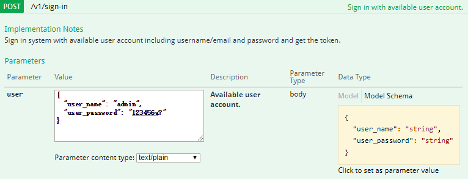
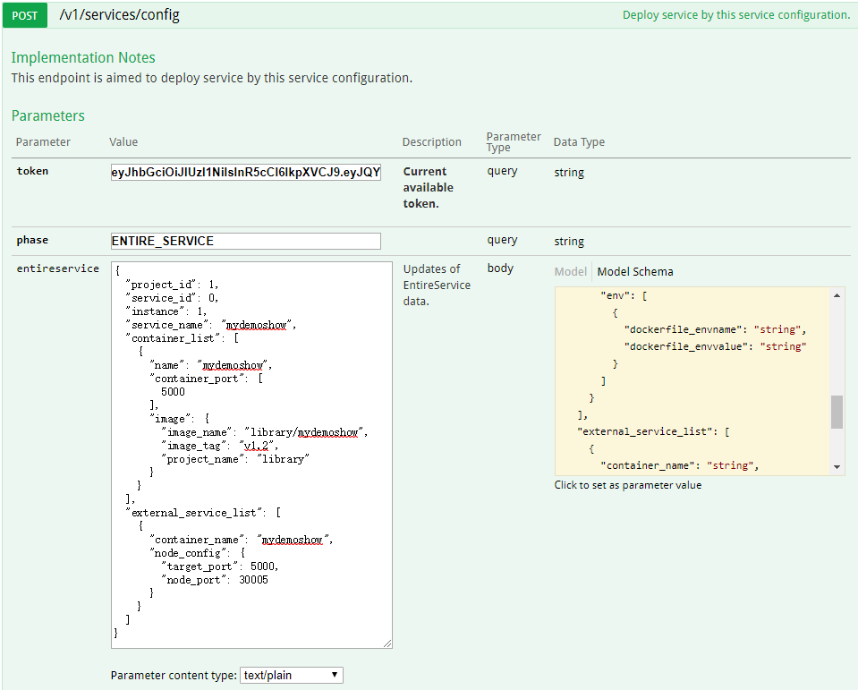
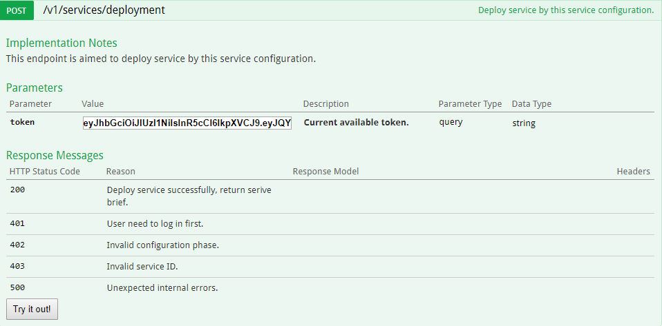

# API Guide  
## Overview  
This guide walks you through the method of using Board API. You'll learn how to use Board API to:  

* Login
  * /api/v1/sign-in
* Deployment Service 
  * /api/v1/services/config
  * /api/v1/services/deployment
* Example

## Login
API of /api/v1/sign-in will be used to login Board. 

### /api/v1/sign-in

* **Post Method**  

    Post method of this API is used to login Board. 

  * **Request Parameters** 

      NULL

  * **Request Body** 
  
    ```
      {
        "user_name": "string",
        "user_password": "string"
      }
    ```       

## Deployment Service 
Deployment service needs to config the service first.
 
### /api/v1/services/config

* **Post Method** 
    
    Post method of this API is used to create service configure.

  * **Request Parameters**  

      Name            | In         | Type        | Description
      ----------------|------------|-------------|--------------
      token           | query      | string      | Current available token          
      phase           | query      | string      | Set phase of config service

  * **Request Body**                                  

      ```
      {
        "project_id": 0,               // project ID in board, type is int64
        "service_id": 0,               // not fill
        "instance": 0,                 // the number of instance, type is int and range is >0
        "service_name": "string",      // service name must be lowercase, type is string 
        "container_list": [            // containers config, type is array of struct 
          {
            "name": "string",          // container name, type is string
            "working_Dir": "string",   // working dir, type is string, it can be null
            "command": "string",       // exec command when container starts, type is string, it can be null
            "container_port": [        // expose port, type is array of int
              0
            ],
            "volume_mounts": {                        // struct about volume mounts, it can be null 
              "target_storage_service": "string",     // service name for volume mounts, type is string
              "target_path": "string",                // service path for volume mounts, type is string 
              "volume_name": "string",                // volume name, type is string
              "container_path": "string"              // path in the container for volumne mounts, type is string
            },
            "image": {                                // struct about image
              "image_name": "string",                 // image name, tpye is string
              "image_tag": "string",                  // image tag, tpye is string
              "project_name": "string"                // project name that image belonged to, type is string
            },
            "env": [                                  // array of environment variable, it can be null 
              {
                "dockerfile_envname": "string",       // the key of environment variable, type is string
                "dockerfile_envvalue": "string"       // the value of environment variable, type is string
              }
            ]
          }
        ],
        "external_service_list": [
          {
            "container_name": "string",    // container name that corresponds to the container_list's container name, type is string 
            "node_config": {               // struct of node config
              "target_port": 0,            // expose port in the container
              "node_port": 0               // default range:30000~32767
            }
          }
        ]
      }
      ```

* **Get Method** 

    Get method of this API is used to get service configure. 

  * **Request Parameters**  

      Name            | In         | Type        | Description
      ----------------|------------|-------------|--------------
      token           | query      | string      | Current available token          
      phase           | query      | string      | Set phase of config service    

  * **Request Body**  

      NULL

### /api/v1/services/deployment

* **Post Method** 
    
    Post method of this API is used to deploy the service which had been configed by API /api/v1/services/config.

  * **Request Parameters**  

      Name            | In         | Type        | Description
      ----------------|------------|-------------|--------------
      token           | query      | string      | Current available token   

  * **Request Body**  

      NULL

## Example
   
### Examples to create services by API

Deploy a service "demoshow"

* Login board



* Get token from Login response

  

* Create service configure

We will build a service named 'mydemoshow', which is belonged to the project of ID 1 and visited through 30005 port of host. It has one instance. The instance has one container named 'mydemoshow'. The container's exposed port is 5000, image name is 'library/mydemoshow', the image tag is 'v1.2', the image is belonged to the project 'library'.

 

* Deploy service

 