# API Guide  
## Overview  
This guide walks you through the method of using Board API. You'll learn how to use Board API to:  

* Login
  * /api/v1/sign-in
* Create user 
  * /api/v1/useradd
* Create project
  * /api/v1/projects
* Deployment Service 
  * /api/v1/services/config
  * /api/v1/services/deployment
* Example


## Sign In

### /api/v1/sign-in

* **Method: Post** 

    This endpoint is used to sign in Board with your account. You can sign in system with LDAP account when enabled ldap_auth mode.

  * **Request** 

      * Request Body
 
        ```
          {
            "user_name": "string",
            "user_password": "string"
          }
        ``` 

  * **Response Messages** 
        
           Status Code    | Description                    | Response Body 
          ----------------|--------------------------------|-------------------------
           200            | User sign in successful        | { <br> "token"："string" <br>}   
           400            | Incorrect username or password | { <br> "status"：400, <br> "message": "Incorrect username or password" <br>}  
           500            | Unexpected internal error      | { <br> "status"：500, <br> "message": "Unexpected internal error" <br>}  

## Add user

### /api/v1/useradd

* **Method: Post**  

    This endpoint is used to add user account for system admin account, when enabled ldap_auth mode, this endpoint is not available.

  * **Request** 

      * Request Headers Parameters
      
          Name           | Kind       | Type     | Required  | Description
          ---------------|------------|----------|-----------|------------------------
          token          | header     | string   | Yes       | Current available token   

      * Request Body
  
        ```
          {
            "user_name": "string",            //user name, required field
            "user_email": "string",           //user email, required field
            "user_password": "string",        //user password, password should be at least 8 characters with at least one 
                                              //uppercase, one lowercase and one number, required field
            "user_realname": "string",        
            "user_comment": "string",         
            "user_system_admin": 0,           //system admin account flag, default is 0 
            "user_project_admin": 0,          //project admin account flag, default is 0
            "user_creation_time": "string",   
            "user_update_time": "string"      
          }
        ```      

  * **Response Messages** 
      
           Status Code    | Description                                       | Response Body 
          ----------------|---------------------------------------------------|-------------------------
           200            | User created successfully                         |    
           400            | Unsatisfied with constraints of the user creation | { <br> "status"：400, <br> "message": "Unsatisfied with constraints of the user creation" <br>}  
           401            | User need to log in first                         | { <br> "status"：401, <br> "message": "User need to log in first" <br>}  
           403            | User registration can only be used by admin role user when self-registration is off | { <br> "status"：403, <br> "message": "User registration can only be used by admin role user when self-registration is off" <br>} 
           500            | Unexpected internal error                         | { <br> "status"：500, <br> "message": "Unexpected internal error" <br>}  

## Create Project

### /api/v1/project

* **Method: Post**  

    This endpoint is for user to create a new project.

  * **Request** 

      * Request Headers Parameters

          Name           | Kind       | Type     | Required  | Description
          ---------------|------------|----------|-----------|------------------------
          token          | header     | string   | Yes       | Current available token   

      * Request Body
    
        ```
          {
            "project_name": "string",            //project name, required field
            "project_comment": "string",         //comment for project, default is null
            "project_public": 0,                 //project public flag, deault is 0 and private project
          }
        ```       

  * **Response Messages** 
      
          Status Code    | Description                    | Response Body 
          ---------------|--------------------------------|-------------------------
          200            | User created successfully      |    
          400            | Unsatisfied with constraints of the user creation | { <br> "status"：400, <br> "message": "Unsatisfied with constraints of the user creation" <br>}  
          401            | User need to log in first      | { <br> "status"：401, <br> "message": "User need to log in first" <br>}  
          500            | Unexpected internal error      | { <br> "status"：500, <br> "message": "Unexpected internal error" <br>}  


* **Method: Get** 

    This endpoint is used to get all projects information in Board. 

  * **Request** 

      * Request Headers Parameters

        Name           | Kind       | Type     | Required  | Description
        ---------------|------------|----------|-----------|------------------------
        token          | header     | string   | Yes       | Current available token   

  * **Response Messages** 
      
        Status Code    | Description                    | Response Body 
        ---------------|--------------------------------|-------------------------
        200            | User created successfully      | Array object about projects information, Refer to the below    
        401            | User need to log in first      | { <br> "status"：401, <br> "message": "User need to log in first" <br>}  
        500            | Unexpected internal error      | { <br> "status"：500, <br> "message": "Unexpected internal error" <br>}  

           Array object about projects information
            ```
              [
                {
                  "project_id": 0,
                  "project_name": "string",
                  "project_comment": "string",
                  "project_creation_time": "string",
                  "project_update_time": "string",
                  "project_deleted": 0,
                  "project_owner_id": 0,
                  "project_owner_name": "string",
                  "project_public": 0,
                  "project_toggleable": true,
                  "project_current_user_role_id": 0, 
                  "project_service_count": 0
                },
                ...            
              ]
            ```   

## Deployment Service 

Deployment service needs to config the service first.
 
### /api/v1/services/config

* **Method: Post**  
    
    This endpoint is used to create service configure.

  * **Request** 

      * Request Headers Parameters

        Name           | Kind       | Type     | Required  | Description
        ---------------|------------|----------|-----------|------------------------
        token          | header     | string   | Yes       | Current available token   

      * Request Query Parameters        

        Name           | Kind       | Type     | Required  | Description
        ---------------|------------|----------|-----------|------------------------
        phase          | query      | string   | Yes       | Set phase of config service

      * Request Body                

        ```
        {
          "project_id": 0,               // project ID in Board, type is int64
          "service_id": 0,               // not fill
          "instance": 0,                 // the number of instance, type is int and range is >0
          "service_name": "string",      // service name must be lowercase, type is string 
          "container_list": [            // containers config, type is array of struct 
            {
              "name": "string",          // container name, type is string
              "working_Dir": "string",   // working dir, type is string, it can be null
              "command": "string",       // exec command when container starts, type is string, it can be null
              "container_port": [        // expose port, type is array of int
                0
              ],
              "volume_mounts": {                        // struct about volume mounts, it can be null 
                "target_storage_service": "string",     // service name for volume mounts, type is string
                "target_path": "string",                // service path for volume mounts, type is string 
                "volume_name": "string",                // volume name, type is string
                "container_path": "string"              // path in the container for volumne mounts, type is string
              },
              "image": {                                // struct about image
                "image_name": "string",                 // image name, tpye is string
                "image_tag": "string",                  // image tag, tpye is string
                "project_name": "string"                // project name that image belonged to, type is string
              },
              "env": [                                  // array of environment variable, it can be null 
                {
                  "dockerfile_envname": "string",       // the key of environment variable, type is string
                  "dockerfile_envvalue": "string"       // the value of environment variable, type is string
                }
              ]
            }
          ],
          "external_service_list": [
            {
              "container_name": "string",    // container name that corresponds to the container_list's container name, type is string 
              "node_config": {               // struct of node config
                "target_port": 0,            // expose port in the container
                "node_port": 0               // default range:30000~32767
              }
            }
          ]
        }
        ```

  * **Response Messages** 
      
           Status Code    | Description                    | Response Body 
          ----------------|--------------------------------|-------------------------
           200            | Config service successfully    |    
           400            | Bad user request               | { <br> "status"：400, <br> "message": "specific error massage" <br>}  
           401            | User need to log in first      | { <br> "status"：401, <br> "message": "User need to log in first" <br>}  
           409            | Request conflict    | { <br> "status"：409, <br> "message": "specific conflict massage" <br>} 
           500            | Unexpected internal error      | { <br> "status"：500, <br> "message": "Unexpected internal error" <br>}    

* **Method: Get** 

    This endpoint is used to get service configure. 

  * **Request** 

      * Request Headers Parameters

        Name           | Kind       | Type     | Required  | Description
        ---------------|------------|----------|-----------|------------------------
        token          | header     | string   | Yes       | Current available token   

      * Request Query Parameters        

        Name           | Kind       | Type     | Required  | Description
        ---------------|------------|----------|-----------|------------------------
        phase          | query      | string   | Yes       | Set phase of config service

  * **Response Messages** 
      
        Status Code    | Description                          | Response Body 
        ---------------|--------------------------------------|-------------------------
        200            | Get service config successfully      | In accordance with the request body of /api/v1/services/config with post method   
        401            | User need to log in first            | { <br> "status"：401, <br> "message": "User need to log in first" <br>}  
        500            | Unexpected internal error            | { <br> "status"：500, <br> "message": "Unexpected internal error" <br>}    

### /api/v1/services/deployment

* **Method: Post** 
    
    This endpoint is used to deploy the service which had been configed by API /api/v1/services/config.

  * **Request** 

      * Request Headers Parameters

        Name           | Kind       | Type     | Required  | Description
        ---------------|------------|----------|-----------|------------------------
        token          | header     | string   | Yes       | Current available token   

  * **Response Messages** 
      
        Status Code    | Description                          | Response Body 
        ---------------|--------------------------------------|-------------------------
        200            | Deployment service successfully      | In accordance with the request body of /api/v1/services/config with post method
        401            | User need to log in first            | { <br> "status"：401, <br> "message": "User need to log in first" <br>}  
        500            | Unexpected internal error            | { <br> "status"：500, <br> "message": "Unexpected internal error" <br>}  

## Example
   
### Examples about deployment services by API

Deploy service "demoshow" with Swagger.

* Configure Swagger 

    Please refer to [View and test Board REST API via Swagger](configure_swagger.md) for configuring Swagger. Then the Swagger UI can be visited with the URL ```http://<host>:<port>/swagger/index.html```.
    
    Demo In Swagger:

    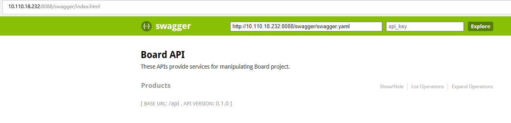

* Sign in Board
    
    Use below request body to sign in Board.

    ```
      {
        "user_name": "admin",
        "user_password": "123456a?"
      }
    ``` 
    
    Demo In Swagger:
    
    

    Get token from the response
    
    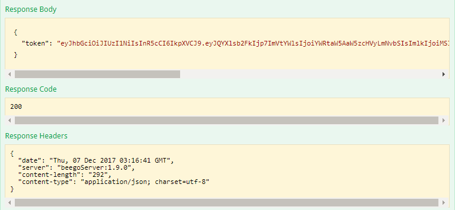  

* Add user for deployment service

    User 'admin' has 'system admin' role, and he has authority for adding user. Add user named as 'inspur002' for deployment service. 

    ```
      {
        "user_name": "inspur002",            
        "user_email": "inspur@inspur.com",           
        "user_password": "123456Aa",             
        "user_comment": "deployment service user",              
        "user_project_admin": 1     
      }
    ```    

    Demo In Swagger:

    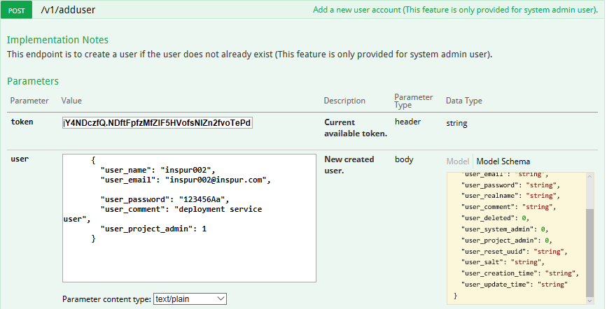

* Sign in Board with new added user's credential

    ```
      {
        "user_name": "inspur002",
        "user_password": "123456Aa"
      }
    ``` 
    
    Demo In Swagger:
    
    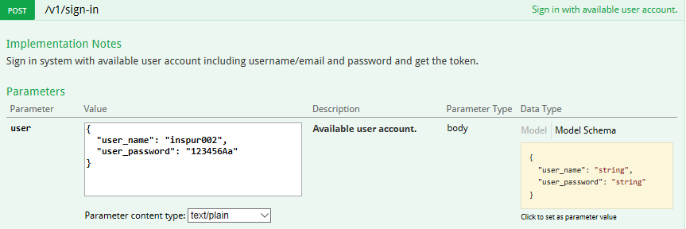

    Get token from the response.

    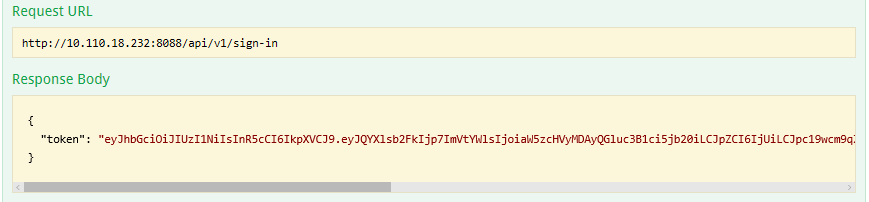  

* Create new project for deployment service

    A new private project will be created with the below request body.

    ```
      {
        "project_name": "deploy001",
        "project_public": 0,
        "project_comment": "private project"
      }
    ``` 

    Demo In Swagger:
    
    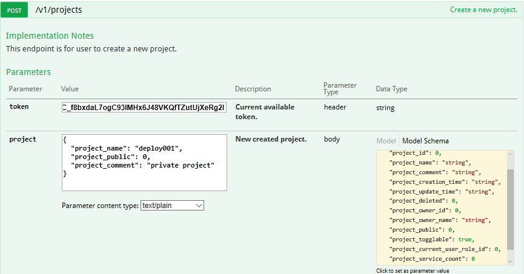  

* Get the new project ID for deployment service

    The below request body will be used to get projects information.

    Demo In Swagger:
    
    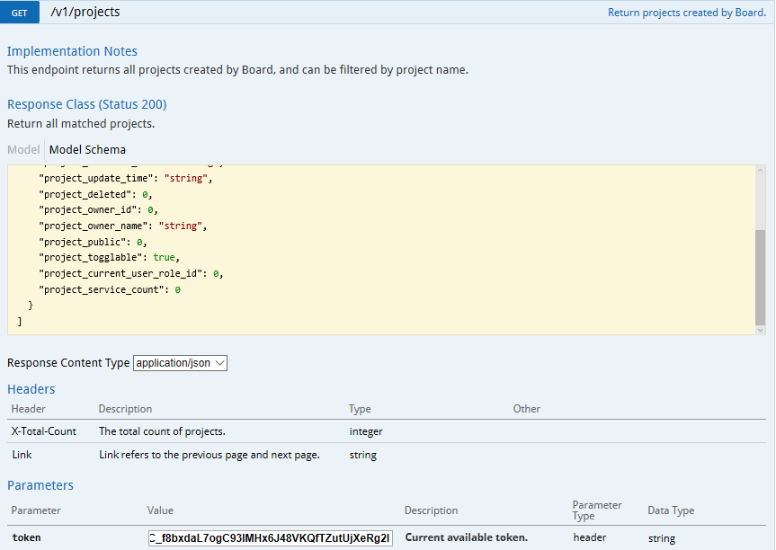  

    Get the project ID from the response.

    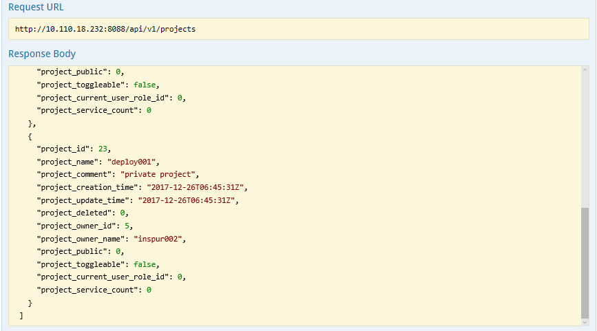 

* Create service configure

      For configuring as 'ENTIRE_SERVICE' that means providing all configuration at one step.
      User compose configuration which belong to the project ID '23', provide service name with 'demoshowing001', and with '1' instance.
      The container template named as 'demoshowing' which is partial of its image name. The container port is '5000' which configured in Dockerfile with EXPOSE and the project name 'library' is equal to the image name's prefix part. You should also provide image tag with '1.0'.
      In order to expose it as an external service, you should provide 'target_port' which is same to the container port number, and the 'node_port' set to '32500' (Range from 30000 to 32767) that is the port number you want to expose to the outside.

    ```
      {
        "project_id": 23,
        "instance": 1,
        "service_name": "demoshowing001",
        "container_list": [
          {
            "name": "mydemoshowing",
            "container_port": [
              5000
            ],
            "image": {
            "image_name": "library/mydemoshowing",
            "image_tag": "1.0",
            "project_name": "library"
            }
          }
        ],
        "external_service_list": [
          {
            "container_name": "mydemoshowing",
            "node_config": {
              "target_port": 5000,
              "node_port": 32500
            }
          }
        ]
      }
    ``` 

    Demo In Swagger:

    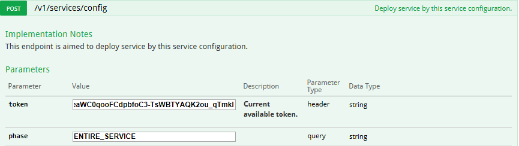 
    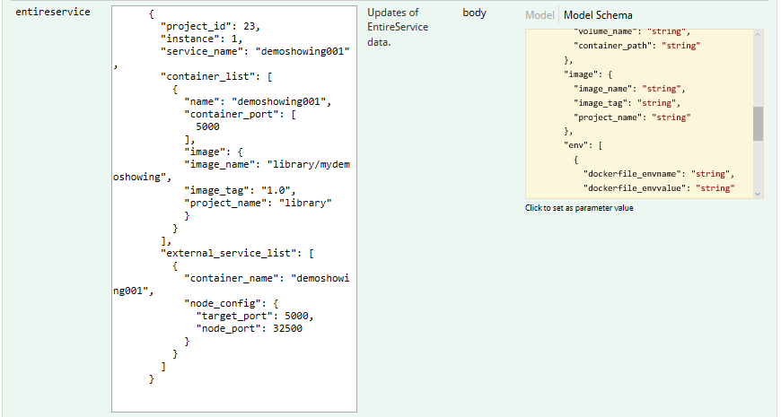 

* Deploy Service
    
    Service configured in the upon section will be deployed.

    Demo In Swagger:

    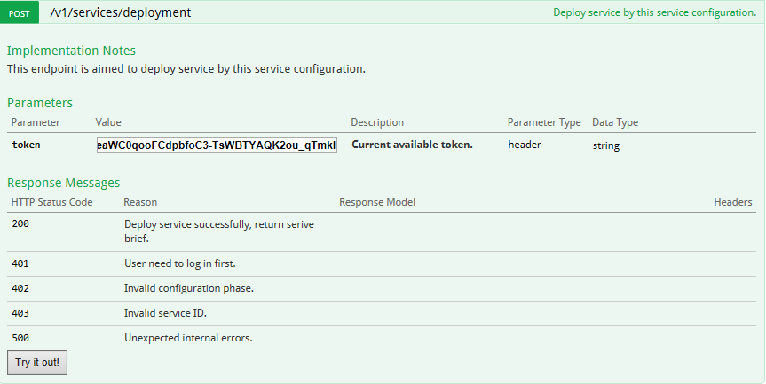 


