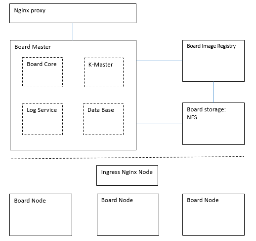
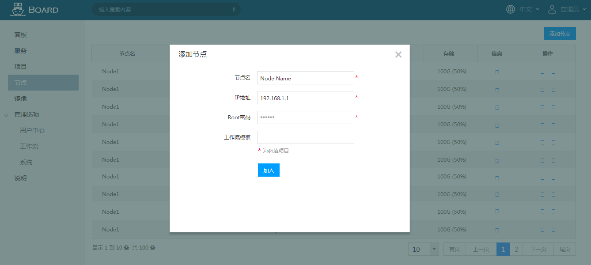

## Board container service platform cluster

The "Board" product is a container platform based on open source technologies, Docker, Kubernetes, Jenkins, MySQL etc. We provide cloud solutions for Inspur software group, including lightweight container virtualization, micro service, DevOps, continuous delivery, help enterprises and development teams achieve fast business application delivery and continuous innovation.

This document is a guide to install a Board cluster. The Board cluster includes all physical components of Board container service platform. The following is a logic structure diagram.




## Board master installation
The Board master is the most important component in Board platform. It is the control center for all other components.

### Board core installation
As its name, the Board core is the core of the whole system, please refer to the [install board core](install_board.md) document for how to build and install board core version 1.0.

### K-master installation

Recommended OS: CentOS7.2

Dependent packages:


| Package Name | Recommended Version |
| --------     | -------- |
| docker-ce| 17.03|
| etcd     | 3.1.3     |
| kubernetes-master     | 1.5.3    |


#### Install and enable docker service

 ```
$ yum -y install docker-1.17.3
$ systemctl enable docker
$ systemctl start docker

 ```

 


#### Install and configure etcd

  The etcd this the main database for Board cluster, should enable this service before other services in master.

```
$ yum install -y etcd
```

Edit the configure file in /etc/etcd/etcd.conf
```
# [member]
ETCD_NAME=default
ETCD_DATA_DIR="/var/lib/etcd/default.etcd"
#ETCD_WAL_DIR=""
#ETCD_SNAPSHOT_COUNT="10000"
#ETCD_HEARTBEAT_INTERVAL="100"
#ETCD_ELECTION_TIMEOUT="1000"
#ETCD_LISTEN_PEER_URLS="http://localhost:2380"
ETCD_LISTEN_CLIENT_URLS="http://127.0.0.1:2379"   # master's IP and port
#ETCD_MAX_SNAPSHOTS="5"
#ETCD_MAX_WALS="5"
#ETCD_CORS=""
#
#[cluster]
#ETCD_INITIAL_ADVERTISE_PEER_URLS="http://localhost:2380"
# if you use different ETCD_NAME (e.g. test), set ETCD_INITIAL_CLUSTER value for this name, i.e. "test=http://..."
#ETCD_INITIAL_CLUSTER="default=http://localhost:2380"
#ETCD_INITIAL_CLUSTER_STATE="new"
#ETCD_INITIAL_CLUSTER_TOKEN="etcd-cluster"
ETCD_ADVERTISE_CLIENT_URLS="http://127.0.0.1:2379"  # master's IP and port

```

Enable etcd service

```
$ systemctl enable etcd.service
$ systemctl start etcd.service
    
```

#### Install and configure kubernetes-master

Board platform customize and optimize [kubernetes](https://kubernetes.io/) as its controller, need to install kubernetes packages in K-master

```
$ yum install -y kubernetes-master
```
Edit the kube-apiserver configure file: /etc/kubenetes/apiserver


```
# The address on the local server to listen to.
KUBE_API_ADDRESS="--insecure-bind-address=0.0.0.0"

# The port on the local server to listen on.
# KUBE_API_PORT="--port=8080"

# Port minions listen on
# KUBELET_PORT="--kubelet-port=10250"

# Comma separated list of nodes in the etcd cluster
KUBE_ETCD_SERVERS="--etcd-servers=http://127.0.0.1:2379"

# Address range to use for services
KUBE_SERVICE_ADDRESSES="--service-cluster-ip-range=10.254.0.0/16"

# default admission control policies
KUBE_ADMISSION_CONTROL="--admission-control=NamespaceLifecycle,NamespaceExists,LimitRanger,SecurityContextDeny,ResourceQuota"

```

Edit the controller-manager file, /etc/kubernetes/controller-manager
Edit the scheduler configuration file, /etc/kubernetes/scheduler
If no particular requirement, just use the default values in these two files.


Start the three services sequentially.
```
$ systemctl enable kube-apiserver.service
$ systemctl start kube-apiserver.service
$ systemctl enable kube-controller.service
$ systemctl start kube-controller.service
$ systemctl enable kube-scheduler
$ systemctl start kube-scheduler
```


## Board node client installation
User can add client node to cluster by accessing Board Web UI automatically. There are some preparations required on the client node before adding.

### Prepare Board-node

Open SSH service

Open Root access by the node IP address

### Add Board-node by Board UI


## Network configuration for Board Cluster

## Board registry installation

## Storage configuration for Board Cluster