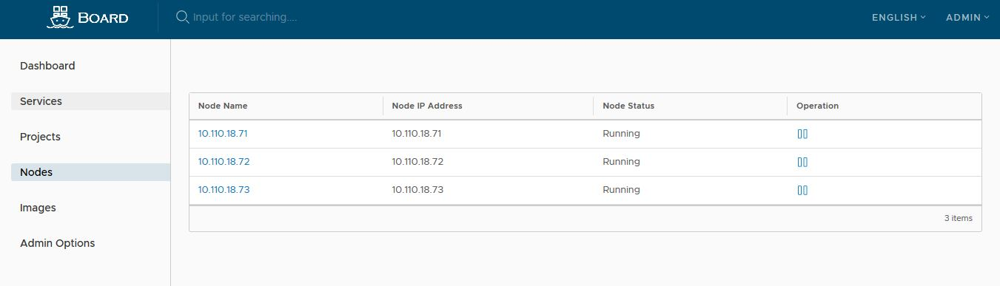
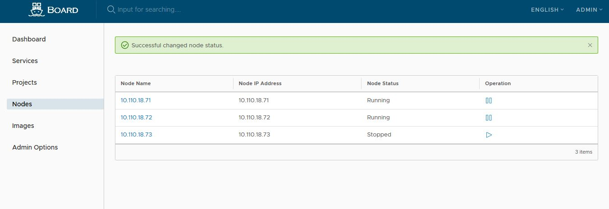

# Installation and Configuration Guide
Board can be installed by one of two approaches: 

- **Online installer:** ~~The installer downloads Board images from Docker hub. For this reason, the installer is very small in size.~~ (Coming soon.)

- **Offline installer:** Use this installer when the host does not have an Internet connection. The installer contains pre-built images so its size is larger.


All installers can be downloaded from the **[official release](http://10.110.18.40:10080/inspursoft/board/releases)** page. 

This guide describes the steps to install and configure Board by using the online or offline installer. The installation processes are almost the same. 

~~If you run a previous version of Board, you may need to update ```board.cfg``` and migrate the data to fit the new database schema. For more details, please refer to **[Board Migration Guide](migration_guide.md)**.~~ (Coming soon.)

~~In addition, the deployment instructions on Kubernetes has been created by the community. Refer to [Board on Board](kubernetes_deployment.md) for details.~~ (Coming soon.)

## Prerequisites for the target host
Board is deployed as several Docker containers, and, therefore, can be deployed on any Linux distribution that supports Docker. The target host requires Python, Docker, and Docker Compose to be installed.  
* Python should be version `2.7 or higher`.  Note that you may have to install Python on Linux distributions (Gentoo, Arch) that do not come with a Python interpreter installed by default  
* Docker engine should be version `17.0 or higher`.  For installation instructions, please refer to: https://docs.docker.com/engine/installation/
* Docker Compose needs to be version `1.7.1 or higher`.  For installation instructions, please refer to: https://docs.docker.com/compose/install/

## Installation Steps

Board has provided two installation methods since `version 3.0`. It is recommended to use the first way to get some additional functions of Board.

1. Install with Adminserver `(recommend)` `(Only available in x86 now)`
  - Download the installer and extract it to `/data/board`;
  - Run **install.sh pre-env.tar.gz** to install and start Adminserver;
  - Access Adminserver on **http://your-IP:8082** in browser and follow the guidelines;
  - Apply after completing the configuration.
2. Normal installation
  - Download the installer;
  - Configure **board.cfg**;
  - Run **install-arm.sh** to install and start Board;

Note: If you need prepare Kubernetes and Registry environment, please refer to the appendix part.

#### Downloading the installer:

The binary of the installer can be downloaded from the [release](http://10.110.18.40:10080/inspursoft/board/releases) page. Choose either online or offline installer. Use *tar* command to extract the package.

Online installer:
    (Coming soon.)
Offline installer:
```
    $ tar xvf board-offline-installer-latest.tgz.tgz
```

#### Configuring Board
Configuration parameters are located in the file **board.cfg**. 

There are two categories of parameters in board.cfg, **required parameters** and **optional parameters**.  

* **required parameters**: These parameters are required to be set in the configuration file. They will take effect if a user updates them in ```board.cfg``` and run the ```install.sh``` script to reinstall Board.
* **optional parameters**: These parameters are optional for updating~~, i.e. user can leave them as default and update them on Web UI after Board is started.  If they are set in ```board.cfg```, they only take effect in the first launch of Board~~. 
Subsequent update to these parameters in ```board.cfg``` will be ignored. 

~~**Note:** If you choose to set these parameters via the UI, be sure to do so right after Board is started. In particular, you must set the desired **auth_mode** before registering or creating any new users in Board. When there are users in the system (besides the default admin user), **auth_mode** cannot be changed.~~

The parameters are described below - note that at the very least, you will need to change the **hostname** attribute. 

##### Required parameters:

* **hostname**: The target host's hostname, which is used to access the UI and the apiserver service. It should be the IP address or the fully qualified domain name (FQDN) of your target machine, e.g., `192.168.1.10` or `reg.yourdomain.com`. _Do NOT use `localhost` or `127.0.0.1` for the hostname - the apiserver service needs to be accessible by external clients!_ 
~~* **ui_url_protocol**: (**http** or **https**.  Default is **http**) The protocol used to access the UI and the token/notification service.  If Notary is enabled, this parameter has to be _https_.  By default, this is _http_. To set up the https protocol, refer to **[Configuring Board with HTTPS Access](configure_https.md)**.  ~~(Coming soon)
* **db_password**: The root password for the MySQL database used for **db_auth**. _Change this password for any production use!_ 
~~* **customize_crt**: (**on** or **off**.  Default is **on**) When this attribute is **on**, the prepare script creates private key and root certificate for the generation/verification of the Board's token. Set this attribute to **off** when the key and root certificate are supplied by external sources. Refer to [Customize Key and Certificate of Board Token Service](customize_token_service.md) for more info.~~(Coming soon)
~~* **ssl_cert**: The path of SSL certificate, it's applied only when the protocol is set to https~~
~~* **ssl_cert_key**: The path of SSL key, it's applied only when the protocol is set to https~~ 
~~* **secretkey_path**: The path of key for encrypt or decrypt the password of a remote registry in a replication policy.~~
~~* **log_rotate_count**: Log files are rotated **log_rotate_count** times before being removed. If count is 0, old versions are removed rather than rotated.~~
~~* **log_rotate_size**: Log files are rotated only if they grow bigger than **log_rotate_size** bytes. If size is followed by k, the size is assumed to be in kilobytes. If the M is used, the size is in megabytes, and if G is used, the size is in gigabytes. So size 100, size 100k, size 100M and size 100G are all valid.~~(Coming soon)

##### Optional parameters
~~* **Email settings**: These parameters are needed for Board to be able to send a user a "password reset" email, and are only necessary if that functionality is needed.  Also, do note that by default SSL connectivity is _not_ enabled - if your SMTP server requires SSL, but does _not_ support STARTTLS, then you should enable SSL by setting **email_ssl = true**. Setting **email_insecure = true** if the email server uses a self-signed or untrusted certificate. For a detailed description about "email_identity" please refer to [rfc2595](https://tools.ietf.org/rfc/rfc2595.txt)``~~
  ~~* email_server = smtp.mydomain.com~~ 
  ~~* email_server_port = 25~~
  ~~* email_identity = ~~
  ~~* email_username = sample_admin@mydomain.com~~
  ~~* email_password = abc~~
  ~~* email_from = admin <sample_admin@mydomain.com>~~  
  ~~* email_ssl = false~~
  ~~* email_insecure = false~~

* **board_admin_password**: The administrator's initial password. This password only takes effect for the first time Board launches. After that, this setting is ignored and the administrator's password should be set in the UI. _Note that the default username/password are **admin/123456a?** ._   
* **auth_mode**: The type of authentication that is used. By default, it is **db_auth**, i.e. the credentials are stored in a database. 
For LDAP authentication, set this to **ldap_auth**.  

   **IMPORTANT:** When upgrading from an existing Board instance, you must make sure **auth_mode** is the same in ```board.cfg``` before launching the new version of Board. Otherwise, users 
may not be able to log in after the upgrade.
* **ldap_url**: The LDAP endpoint URL (e.g. `ldaps://ldap.mydomain.com`). Only used when **auth_mode** is set to *ldap_auth* .
* **ldap_searchdn**: The DN of a user who has the permission to search an LDAP/AD server (e.g. `uid=admin,ou=people,dc=mydomain,dc=com`).
* **ldap_search_pwd**: The password of the user specified by *ldap_searchdn*.
* **ldap_basedn**: The base DN to look up a user, e.g. `ou=people,dc=mydomain,dc=com`. Only used when **auth_mode** is set to *ldap_auth* .
* **ldap_filter**:The search filter for looking up a user, e.g. `(objectClass=person)`.
* **ldap_uid**: The attribute used to match a user during a LDAP search, it could be uid, cn, email or other attributes.
* **ldap_scope**: The scope to search for a user, LDAP_SCOPE_BASE, LDAP_SCOPE_ONELEVEL, LDAP_SCOPE_SUBTREE. Default is LDAP_SCOPE_SUBTREE. 
* **self_registration**: (**on** or **off**. Default is **on**) Enable / Disable the ability for a user to register himself/herself. When disabled, new users can only be created by the Admin user, only an admin user can create new users in Board. _NOTE_: When **auth_mode** is set to **ldap_auth**, self-registration feature is **always** disabled, and this flag is ignored.  
* **token_expiration**: The expiration time (in minutes) of a token created by token service, default is 30 minutes.

#### Connecting Kubernetes cluster which authentication strategy with CA certification
If the Kubernetes cluster which Board connect to authentication strategy with CA certification, you must copy the Kubernetes cluster's CA files to your machine which installing the Board. You should put CA files into /etc/board/cert directory and name them as 'ca-key.pem'(for private key) and 'ca.pem'(for public key).

Then you should configure these items:

* **kube_http_scheme**: Set to 'https'. It means the requests Board send to Kubernetes cluster will be used via 'https' protocol.
* **kube_master_ip**: The IP address of the Master of Kubernetes cluster.
* **kube_master_port**: The port number of the Master of Kubernetes cluster(maybe 443 or 6443).

#### Finishing installation and starting Board
Once **board.cfg** is configured, install and start Board using the ```install.sh``` script.  ~~Note that it may take some time for the online installer to download Board images from Docker hub.~~ (Coming soon)  

##### Default installation 

```sh
    $ sudo ./install.sh
```

If everything worked properly, you should be able to open a browser to visit the admin portal at **http://reg.yourdomain.com** (change *reg.yourdomain.com* to the hostname configured in your ```board.cfg```). Note that the default administrator username/password are admin/123456a? .

Log in to the admin portal and create a new project, e.g. `myproject`. You can create your own service now.

For information on how to use Board, please refer to **[User Guide of Board](user_guide.md)** .

#### Configuring Board with HTTPS access
~~Board does not ship with any certificates, and, by default, uses HTTP to serve requests. While this makes it relatively simple to set up and run - especially for a development or testing environment - it is **not** recommended for a production environment. To enable HTTPS, please refer to **[Configuring Board with HTTPS Access](configure_https.md)** .~~ (Coming soon)


### Managing Board's lifecycle
You can use docker-compose to manage the lifecycle of Board. Some useful commands are listed as follows (must run in the same directory as *docker-compose.yml*).

Stopping Board:
```
$ sudo docker-compose stop
Stopping deploy_proxy_1       ... done
Stopping deploy_apiserver_1   ... done
Stopping deploy_collector_1   ... done
Stopping deploy_gitserver_1   ... done
Stopping deploy_jenkins_1     ... done
Stopping deploy_mysql_1       ... done
Stopping deploy_tokenserver_1 ... done
Stopping deploy_log_1         ... done
```  
Restarting Board after stopping:
```
$ sudo docker-compose start
Creating deploy_proxy_1       ... done
Creating deploy_apiserver_1   ... done
Creating deploy_collector_1   ... done
Creating deploy_gitserver_1   ... done
Creating deploy_jenkins_1     ... done
Creating deploy_mysql_1       ... done
Creating deploy_tokenserver_1 ... done
Creating deploy_log_1         ... done
```  

To change Board's configuration, first stop existing Board instance and update ```board.cfg```. Then run ```prepare``` script to populate the configuration. Finally re-create and start Board's instance:
```
$ sudo docker-compose down -v
$ vim board.cfg
$ sudo prepare
$ sudo docker-compose up -d
``` 

Removing Board's containers while keeping the image data and Board's database files on the file system:
```
$ sudo docker-compose down -v
```  

Removing Board's database and image data (for a clean re-installation):
```sh
$ rm -r /data/board
```

Please check the [Docker Compose command-line reference](https://docs.docker.com/compose/reference/) for more on docker-compose.

### Persistent data and log files
By default, Board data is persisted in the host's `/data/` directory.  This data remains unchanged even when Board's containers are removed and/or recreated.  

In addition, Board uses *rsyslog* to collect the logs of each container. By default, these log files are stored in the directory `/var/log/board/` on the target host for troubleshooting.  

## Configuring Board listening on a customized port
By default, Board listens on port 80(HTTP) and 443(HTTPS, if configured) for both admin portal and docker commands, you can configure it with a customized one.  

### For HTTP protocol

1.Modify docker-compose.yml  
Replace the first "80" to a customized port, e.g. 8888:80.  

```
proxy:
    image: library/nginx:1.11.5
    restart: always
    volumes:
      - ./config/nginx:/etc/nginx
    ports:
      - 8888:80
      - 443:443
    depends_on:
      - mysql
      - registry
      - ui
      - log
    logging:
      driver: "syslog"
      options:  
        syslog-address: "tcp://127.0.0.1:1514"
        tag: "proxy"
```

2.Modify board.cfg, add the port to the parameter "hostname"  

```  
hostname = 192.168.0.2:8888
```

3.Re-deploy Board refering to previous section "Managing Board's lifecycle".

## Unistallation Steps 

### if using install.sh to install

**Warning: DO NOT use uninstall.sh to uninstall**

#### shutdwon Board

You need to stop existing Board instance in Adminserver.

#### remove Board image

Use `docker-compose -f docker-compose-rest.yml down --rmi all` to remove images of Board.

#### remove Database

Use `docker-compose -f docker-compose-db.yml down --rmi all` to stop database and remove images of database.

#### remove Adminserver

Check wheather the `env` file exists in `/data/board/Deploy/config/adminserver/`. If it does not exist, run `cp /data/board/Deploy/templates/adminserver/env-release /data/board/Deploy/config/adminserver/env` to restore it. And then you can use `docker-compose -f ./docker-compose-adminserver.yml down --rmi all` to stop Adminserver and remove images of Adminserver.

#### remove data [Optional]

You can use `rm -rf /data/board` to remove all data of Board (includes Adminserver). Before you do it, you should back up your data.

### if using install-arm.sh to install

Use `./uninstall.sh` to uninstall.

## Troubleshooting

0. When you encounter problems with `ERROR: Couldn't find env file: /data/board/Deploy/config/adminserver/env` when up or down Adminserver, you can use `cp /data/board/Deploy/templates/adminserver/env-release /data/board/Deploy/config/adminserver/env` to solve it, and then you can normally up and down Adminserver.

1. When Board does not work properly, run the below commands to find out if all containers of Board are in **UP** status: 

```
    $ sudo docker-compose ps

CONTAINER ID        IMAGE               COMMAND                  CREATED             STATUS              PORTS                                NAMES
62cb2eb426fa        board_nginx         "nginx -g 'daemon ..."   5 minutes ago       Up 3 seconds        0.0.0.0:80->80/tcp                   deploy_proxy_1
2bb582969018        board_apiserver     "sh /usr/bin/entry..."   5 minutes ago       Up 3 seconds        0.0.0.0:8088->8088/tcp               deploy_apiserver_1
135bfdfa6046        board_collector     "/usr/bin/collector"     5 minutes ago       Up 2 seconds        8080/tcp                             deploy_collector_1
2fb85aec5bdd        board_gitserver     "sh entrypoint.sh"       5 minutes ago       Up 4 seconds        22/tcp                               deploy_gitserver_1
59c112ec88be        board_jenkins       "/bin/tini -- /usr..."   5 minutes ago       Up 4 seconds        8080/tcp, 0.0.0.0:50000->50000/tcp   deploy_jenkins_1
d4985d4f21b7        board_mysql         "docker-entrypoint..."   5 minutes ago       Up 4 seconds        0.0.0.0:3306->3306/tcp               deploy_mysql_1
30d297841029        board_tokenserver   "/usr/bin/tokenserver"   5 minutes ago       Up 4 seconds        4000/tcp                             deploy_tokenserver_1
efc3e8ff4585        board_log           "/bin/sh -c 'crond..."   5 minutes ago       Up 5 seconds        0.0.0.0:1514->514/tcp                deploy_log_1

```

If a container is not in **UP** state, check the log file of that container in directory ```/var/log/board```. For example, if the container ```apiserver``` is not running, you should look at the log file ```apiserver.log```.  


2.When setting up Board behind an nginx proxy or elastic load balancing, look for the line below, in `common/templates/nginx/nginx.http.conf` and remove it from the sections if the proxy already has similar settings: `location /`, `location /v2/` and `location /service/`.
```
proxy_set_header X-Forwarded-Proto $scheme;
```
and re-deploy Board refer to the previous section "Managing Board's lifecycle".


## Appendix 

### Kubernetes Cluster Install

Recommended OS: CentOS7.2

Dependent packages:


| Package Name | Recommended Version |
| --------     | -------- |
| docker-ce| 17.03|
| etcd     | 3.1.3     |
| kubernetes-master     | 1.5.3    |


#### Install and Enable Docker Service

 ```
$ yum -y install docker-1.17.3
$ systemctl enable docker
$ systemctl start docker

 ```

 


#### Install and configure etcd

  The etcd this the main database for Board cluster, should enable this service before other services in master.

```
$ yum install -y etcd
```

Edit the configure file in /etc/etcd/etcd.conf
```
# [member]
ETCD_NAME=default
ETCD_DATA_DIR="/var/lib/etcd/default.etcd"
#ETCD_WAL_DIR=""
#ETCD_SNAPSHOT_COUNT="10000"
#ETCD_HEARTBEAT_INTERVAL="100"
#ETCD_ELECTION_TIMEOUT="1000"
#ETCD_LISTEN_PEER_URLS="http://localhost:2380"
ETCD_LISTEN_CLIENT_URLS="http://127.0.0.1:2379"   # master's IP and port
#ETCD_MAX_SNAPSHOTS="5"
#ETCD_MAX_WALS="5"
#ETCD_CORS=""
#
#[cluster]
#ETCD_INITIAL_ADVERTISE_PEER_URLS="http://localhost:2380"
# if you use different ETCD_NAME (e.g. test), set ETCD_INITIAL_CLUSTER value for this name, i.e. "test=http://..."
#ETCD_INITIAL_CLUSTER="default=http://localhost:2380"
#ETCD_INITIAL_CLUSTER_STATE="new"
#ETCD_INITIAL_CLUSTER_TOKEN="etcd-cluster"
ETCD_ADVERTISE_CLIENT_URLS="http://127.0.0.1:2379"  # master's IP and port

```

Enable etcd service

```
$ systemctl enable etcd.service
$ systemctl start etcd.service
    
```

#### Install and Configure Kubernetes Master

Board platform customize and optimize [kubernetes](https://kubernetes.io/) as its controller, need to install kubernetes packages in K-master

```
$ yum install -y kubernetes-master
```
Edit the kube-apiserver configure file: /etc/kubenetes/apiserver


```
# The address on the local server to listen to.
KUBE_API_ADDRESS="--insecure-bind-address=0.0.0.0"

# The port on the local server to listen on.
# KUBE_API_PORT="--port=8080"

# Port minions listen on
# KUBELET_PORT="--kubelet-port=10250"

# Comma separated list of nodes in the etcd cluster
KUBE_ETCD_SERVERS="--etcd-servers=http://127.0.0.1:2379"

# Address range to use for services
KUBE_SERVICE_ADDRESSES="--service-cluster-ip-range=10.254.0.0/16"

# default admission control policies
KUBE_ADMISSION_CONTROL="--admission-control=NamespaceLifecycle,NamespaceExists,LimitRanger,SecurityContextDeny,ResourceQuota"

```

Edit the controller-manager file, /etc/kubernetes/controller-manager
Edit the scheduler configuration file, /etc/kubernetes/scheduler
If no particular requirement, just use the default values in these two files.


Start the three services sequentially.
```
$ systemctl enable kube-apiserver.service
$ systemctl start kube-apiserver.service
$ systemctl enable kube-controller.service
$ systemctl start kube-controller.service
$ systemctl enable kube-scheduler
$ systemctl start kube-scheduler
```
#### Install and Configure Kubernetes Nodes

Install kubernetes node softwares on a node
```
$ yum install -y docker kubelet kubeadm kubectl kubernetes-cni
```

Start docker on a node
```
$ systemctl enable docker && systemctl start docker
```

Start kubelet on a node
```
$ systemctl enable kubelet && systemctl start kubelet
```

Join the kubernetes cluster
```
$ kubeadm join --token <token> <KUBE_MASTER_IP:PORT>
```

* Manage the nodes in the cluster by Board

User can monitor all nodes in the current cluster by the Board system, click the "nodes" button:


User can manage the nodes by operations, such as remove a node from the cluster:


### Network Configuration
Need to configure network option to enable the network communication between different pods of different nodes in cluster. 
There are a number of ways that this network model can be implemented.

#### Configure flannel network
```
$ yum install -y flannel
```

Edit the service file /usr/lib/systemd/system/flanneld.service
```
Before=docker.service
EnvironmentFile=/etc/sysconfig/flanneld
```

Edit the configuration file  /etc/sysconfig/flanneld

ETCD server:
```
FLANNEL_ETCD="http://127.0.0.1:2379"
FLANNEL_ETCD_KEY="/atomic.io/network"
```

Add a network subnet to ETCD server
```
$etcdctl set /atomic.io/network/config '{"Network": "10.1.0.0/16"}'
```

Configure docker network
```
$ /usr/libexec/flannel/mk-docker-opts.sh -i
$ source /run/flannel/subnet.env
$ ifconfig docker0 ${FLANNEL_SUBNET}
$ systemctl restart docker
```

### Storage Configuration 
Support NFS storage and Ceph storage system

### NFS
Need to configure every node to support NFS as NFS client
```
$ yum install -y nfs-utils rpcbind
$ systemctl enable rpcbind.service
$ systemctl start rpcbind.service
$ showmount -e $1

```
#### Setup a NFS server

### Registry Installation
Get registry image from docker.io and install
```
docker pull registry
docker run -d -p 5000:5000 --name registry registry
```
Get registry image from here: 

**[Download Registry image from docker hub](https://hub.docker.com/_/registry)**

Load registry image and setup registry container
```
docker load --input regstiry.tar
docker run -d -p 5000:5000 --name registry registry
```
Config registries, please reference docker offical document https://docs.docker.com. Below example for Centos, Edit the file /etc/docker/daemon.json, the content as below:

```
{
    "live-restore": true,
    "insecure-registries":["0.0.0.0/0"]
}
```

Verify the registry:
```
curl http://LocalHost($hostIP):5000/v2/_catalog
```
If retrun {"repositories":[]} It's work well

Push image to the registry, example:
```
docker tag mysql:5.6 LocalHost($hostIP):5000/mysql:5.6
docker push LocalHost($hostIP):5000/mysql:5.6
```
Verify the image pushed to the registry successsful:
```
curl http://LocalHost($hostIP):5000/v2/_catalog
reurn {"repositories":["mysql"]}
```

### Ansible One-step Install
Get Ansible resources：
````
git clone http://10.110.18.40:10080/guyingyan/ansible.git
````
Set up environment with ansible on-step:
```
To see README.md
```
### install with ansible script One-step Install
Get Ansible resources：
````
git clone https://github.com/inspursoft/board-installer.git
````
Set up enrionment with Ansible on-step:
```
To see README.md
```

### Limitation
When you need install, please note the limitations:

1. If you want to use CentOS、Redhat and Ubuntu, you need install CentOS, Redhat 7.4 or higher version, install Ubuntu 18.04.
2. To install Board, the host should with Docker 19.03 or higher version.

### Ports Reservation
There are some ports which Board and Kubernetes installation will be used, these ports should be accepted by firewall of the servers.

Board:

| Component | Port Numbers |
| -------- | -------- |
| board-log | 1514 |
| board-gogits | 10022, 10080 |
| board-apiserver | 8088 |
| board-ui | 80 |
| board-graphite | 2003 |
| board-elasticsearch | 9200 |
| jenkins | 8888 |

Kubernetes master:

| Component | Port Numbers |
| -------- | -------- |
| kube-apiserver | 8080, 6443 |
| kube-scheduler | 10251 |
| kube-controller-manager | 10252 |
| etcd | 2379, 2380 |

Kubernetes node(s):

| Component | Port Numbers |
| -------- | -------- |
| kubelet | 10248, 10250, 10255 |
| kube-proxy | 10256 |
| cAdvisor | 4194 |

