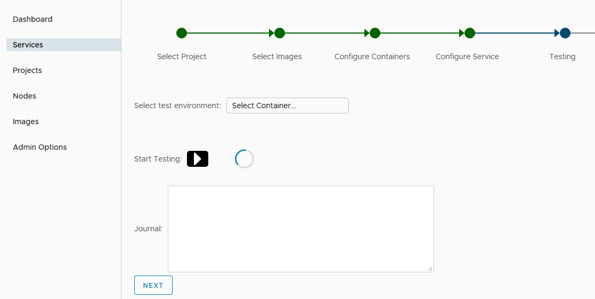
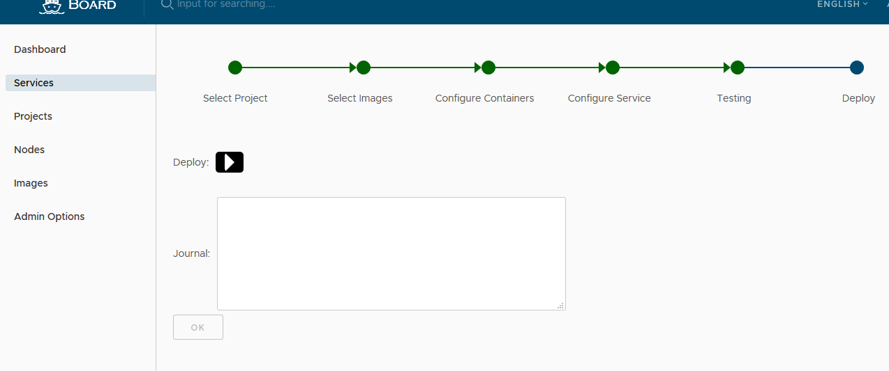
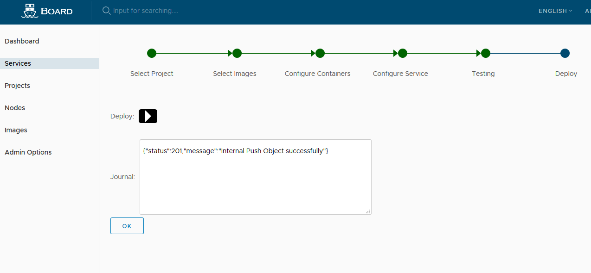

# User Guide  
## Overview  
This guide walks you through the fundamentals of using Board. You'll learn how to use Board to:  

* User Account
* Role Based Access Control(RBAC)  
* Manage Projects
* Manage Members of a Project
* Manage Services
  * Build Images.
  * Build Services.
  * Test Services.
  * Deploy Services.
* Search Projects, Services, Users and Images.
* Monitoring Dashboard
* Administrator Options
* Q&A

## User account
Board supports databse authentication modes, will support LDAP next release:  

* **Database(db_auth)**  

	Users are stored in the local database.  
	
	A user can register himself/herself in Board in this mode. To disable user self-registration, refer to the [installation guide](installation_guide.md) for initial configuration, or disable this feature in [Administrator Options](#administrator-options). When self-registration is disabled, the system administrator can add users into Board. 
	
	When registering or adding a new user, the username and email must be unique in the Board system. The password must contain at least 8 characters with 1 lowercase letter, 1 uppercase letter and 1 numeric character.  
	
	When you forgot your password, you can follow the below steps to reset the password(need SMTP server support):  

	1. Click the link "Forgot Password" in the sign in page.  
	2. Input the email address entered when you signed up, an email will be sent out to you for password reset.  
	3. After receiving the email, click on the link in the email which directs you to a password reset web page.  
	4. Input your new password and click "Save".  
	
* **LDAP/Active Directory (ldap_auth)**  

	Support in next release

## Role Based Access Control(RBAC)  

Board manages services through projects on container service platform. Users can be added into one services as a member with 3 different roles:  

* **Guest**: Guest has read-only privilege for public project and sevices.
* **ProjectMember**: Developer has read and write privileges for a project.
* **ProjectAdmin**: When creating a new project, you will be assigned the "ProjectAdmin" role to the project. Besides read-write privileges, the "ProjectAdmin" also has some management privileges, such as adding and removing members.

Besides the above three roles, there are two system-wide roles:  

* **SysAdmin**: "SysAdmin" has the most privileges. In addition to the privileges mentioned above, "SysAdmin" can also list all projects, set an ordinary user as administrator, delete users. The public project "library" is also owned by the administrator.  
* **Anonymous**: When a user is not logged in, the user is considered as an "Anonymous" user. An anonymous user has no access to private projects and has read-only access to public projects and services.  

## Manage Projects

## Manage Members of a Project

## Manage Services

Board supports creating container service. All services must be grouped by projects. Click into "create service", the first step is to select a project. if there is no project, please create a project first. 

### Build Images
On the "select images" page, select "Create Custom Image" from the pull-down menu to build new image.
There will be a pop-up window for user to input image parameters for building.
* New Image Name
* Image Tag
* Base Image
* Image EntryPoint
* Image Env
* Image Volume
* Image Run
* Image Expose
* Upload External Archives

After fill in all required parameters, click "Build image" to start building the new image.
If build successfully, the new image will be added into Board's registry.

### Build Services

The "select images" is the first step to build service.  
Select required image and its image tag, select multiple images if needed.

Next step to configure containers.
The following parameters could be customized for containers of this service.
* Working Directory
* Volume Mounts
* ENV
* Container Port
* Commands

Next step to configure service.
The following parameters could be customized for this service.
* Service Name
* Instance

In the advanced configuration, can assign node pord for external service.

Next step after configure service.

### Test Service

This step is to test the service's configurations. Next step to skip testing.

### Deploy Service

Click "Deploy" to deploy the new service.
After successfully deploy the service, user can monitor the service status from the service list.

### Examples to create services

#### Example demoshow
Deploy a service "demoshow"

* Login board

* Select the library project

* Select library/mydemoshow image

* Configure container

* Select container mydemoshow

* Set the container port to 5000

* Set the service name

* Set the node port for external service

* Test the service

* Deploy the service demoshow

* Deploy the demoshow successfully

## Search Projects, Services, Users and Images
Board search  engine could search project, service, users and image.
### Search categories
* **project**:
Users can search projects with some constraints: 

 > 1. Ordinary users only can search these projects which they blong to 
   and common project 
 > 2. System admin can search all of projetcs

* **service**:
Users can search services with some constraints: 

 > 1.  Ordinary users only can search services which is owner of the service，
    or blong a same project.
 > 2.  System admin can search all of projetcs

* **user**
Users can search users with some constraints: 

 > 1.  project admin can search user which is belong to this project.
 > 2.  System admin can search all of users

* **image**

 > 1.  Ordinary users only can search images which blong a same project or common images.
 > 2.  System admin can search all of iamges

### Search results
* **search results** as shown below

## Monitoring Dashboard
 **Monitoring Dashboard** collect logs from k8s master and nodes. It cover the 
machine indicators, such as cpu, memory usage, file system and k8s services runtime.
* **services runtime** collect all af service and corresponding to labels of pods and containers. In
dashboard show the statistical real-time and average numbers
 
* **machine indicators** collect all cpu and memory nodes indicators of all nodes
 
* **file system** collect all storage indicators of nodes
 

## Administrator Options

## Q&A

