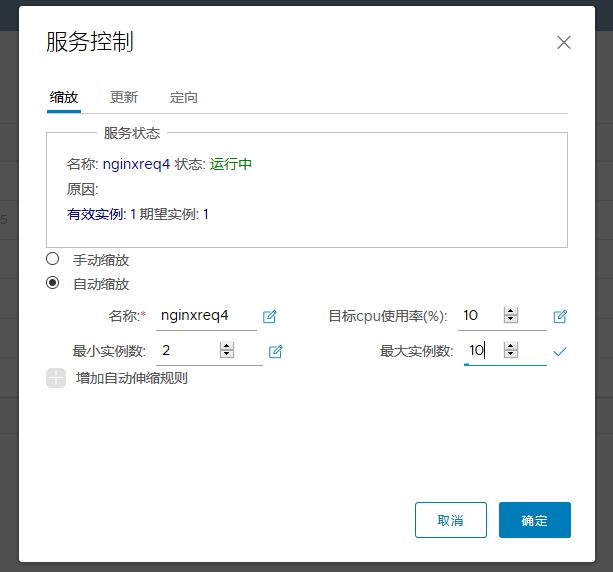

## User Guide  
## Overview  
This guide walks you through the fundamentals of using Board. You'll learn how to use Board to:  

* User Account
* Project Based Access Control 
* Manage Projects
* Manage Members of a Project
* Manage Services
  * Build Image
  * Build Service
  * Test Service
  * Deploy Service
  * Scale Service
  * Update Service
* Manage DevOps
  * Introduction
  * Configure External Gogits and Jenkins
  * All-in-One Account Access
  * Create Project for Gogits and Jenkins
  * Review the Repository on Gogits
  * Review the Pipeline Job on Jenkins
  * Add Member to the Project to Make a Fork for the Repository
* Search Projects, Services, Users and Images.
* Monitoring Dashboard
* Administrator Options
* Action Audit
* Q&A

## User account
Board supports databse authentication modes and support LDAP mode:  

* **Database(db_auth)**  

	Users are stored in the local database.  
	
	A user can register himself/herself in Board in this mode. To disable user self-registration, refer to the [installation guide](installation_guide.md) for initial configuration, or disable this feature in [Administrator Options](#administrator-options). When self-registration is disabled, the system administrator can add users into Board. 
	
	When registering or adding a new user, the username and email must be unique in the Board system. The password must contain at least 8 characters with 1 lowercase letter, 1 uppercase letter and 1 numeric character.  
	
* **LDAP/Active Directory (ldap_auth)**  

	Under this authentication mode, users whose credentials are stored in an external LDAP or AD server can log in to Board directly.  
	
	When an LDAP/AD user logs in by *username* and *password*, Board binds to the LDAP/AD server with the **"LDAP Search DN"** and **"LDAP Search Password"** described in [installation guide](installation_guide.md). If it succeeded, Board looks up the user under the LDAP entry **"LDAP Base DN"** including substree. The attribute (such as uid, cn) specified by **"LDAP UID"** is used to match a user with the *username*. If a match is found, the user's *password* is verified by a bind request to the LDAP/AD server.  
	
	Self-registration, changing password and resetting password are not supported under LDAP/AD authentication mode because the users are managed by LDAP or AD.  

* **User password find back**  	

    User can find back the password by email:
	
	Click the "forgot password" in the login page:
	
	
	Input the user name or the registered email account:
	
	
	
	Click send request:
	
	
	User will receive an email to reset password in the registered email account
	
	
## Project Based Access Control  

Board manages services through projects on container service platform. Users can be added into system as a member with different roles:  

* **Anonymous**: When a user is not logged in, the user is considered as an "Anonymous" user. An anonymous user has no access to private projects and has read-only access to public projects and services.  
* **Registry User**: When a user logs in, the user will have the authority to create a new project or be pulled into an existing project.
* *** ProjectAdmin ***: When creating a new project, the user will be assigned the "ProjectAdmin" role in new project. The "ProjectAdmin" can invite users join the project  which created by himself.
* *** ProjectMember ***: When invited in to one exist project, the user will be assigned the "ProjectMember" role in new project. The "ProjectMember" can create and delete the service in the project but can not delete the project. One user isn't a member of one project, can't create or delete service in this project, can't access it's private service.
* **SysAdmin**: "SysAdmin" has the most privileges. In addition to the privileges mentioned above, "SysAdmin" can also list all projects, set an ordinary user as administrator, delete users. The public project "library" is also owned by the administrator.  


## Manage Projects
A project in Board contains all services, images etc., There are two types of projects in Board:

* **Public**: All users have the read privilege to a public project, it's convenient for you to share some services or others in this way.

* **Private**: A private project can only be accessed by users with proper privileges.

You can create a project after you signed in. Check on the "Public/Private" checkbox will make this project public.


After the project is created, you can browse services, users and images using the navigation bar on  the left.

## Manage Members of a Project
### Adding members

You can add members with different roles to an existing project.


### Updating and removing members

You can update or remove a member by clicking the left arrow to remove or right to add member in the middle of the users and members list.


## Manage Services

Board supports creating container service. All services must be grouped by projects. Click into "create service", the first step is to select a project. if there is no project, please create a project first. 

### Build Images
On the "select images" page, select "Create Custom Image" from the pull-down menu to build new image. Or on the "images" page, click "create image"
Surpport three method to create images that are "Use template for creaton", "Use Dockerfile for creation", "Create by DevOps method"(will be surpport)
Use template for creaton：
There will be a pop-up window for user to input image parameters for building.
* New Image Name
* Image Tag
* Base Image
* Image EntryPoint
* Image Env
* Image Volume
* Image Run
* Image Expose
* Upload External Archives
* Command

Use Dockerfile for creation:
There will be a pop-up window for user to input image parameters for building.
* New Image Name
* Image Tag
* Select Dockerfile for build image

After fill in all required parameters, click "Build image" to start building the new image.
If build successfully, the new image will be added into Board's registry.

### Build Services

The "select images" is the first step to build service.  
Select required image and its image tag, select multiple images if needed.

Next step to configure containers.
The following parameters could be customized for containers of this service.
* Working Directory
* Volume Mounts
* ENV
* Container Port
* Commands

Next step to configure service.
The following parameters could be customized for this service.
* Service Name
* External service
* Instance

In the advanced configuration, can assign node port for external service.

In node selector, locate a service to the designated node or node group. 


Get all available nodes or node groups and select one.


Next step after configure service.

### Test Service

This step is to test the service's configurations. Next step to skip testing.

### Deploy Service

Click "Deploy" to deploy the new service.
After successfully deploy the service, user can monitor the service status from the service list.

### Scale Service
Click the "control" icon in the sevice list page, pop up the service control page


Select manually scale, set the desired instance number, and confirm it.


### AutoScale Service
To use the autoscale, first need to create a service with resource request.  The following is to create a nginx
service with 200m CPU and 64Mi Memory request.
  


Click the "control" icon in the sevice list page, pop up the service control page.
In this control page, user can scale the service on runtime and configure the auto-scale rule for this service.


Choose the autoscale


Add a autoscale rule for this service.


Confirm this configuration.

Continuously access this nginx service to give a certain stress. 
User can check the pod number of this service by the dashboard page.


### Update Service
Click the "control" icon in the sevice list page, pop up the service control page.
Select the "update" tab.


Choose the new version tag in the image list.


Confirm it, then this service will be rolling updated to the new version.


### Update Service

### Examples to create services

#### Example demoshow
Deploy a service "demoshow"

* Login board


* Select the library project


* Select library/mydemoshow image


* Configure container


* Select container mydemoshow


* Set the container port to 5000


* Set the service name


* Set the node port for external service


* Deploy the service demoshow


* Deploy the demoshow successfully


* Service can be showed in service list


#### Example inspur bigdata
Deploy a service "bigdata" which is a containerized project for the Inspur bigdata software platform.

* Start to create a service


* Select a project


* Add images for this service


* Select images for this service


* Select two images for this service


* Configure containers


* Configure storage volume for the mysql container


* Configure environment parameters


* Configure container ports


* Configure the bigdata service


* Configure the external node port


#### Manage DevOps

### Introduction

> Board now supports DevOps as external Gogit and Jenkin CI services.


### Configure External Gogits and Jenkins

> You should provide configurations before starting DevOps.


> Then execute command ```./make prepare```

### All-in-One Account Access

> When signed up in Board, you also has made same authorization on Gogits.


 * You can sign in Gogits with the same authorization in Board.


 * Retrieve user list in Board.


 * You also can retrieve the same user list in Gogits.


### Create Project for Gogits and Jenkins

> By integrating access token with Gogits and web-hooks with Jenkins, Board can create project coordinated with repository creation on Gogits and pipeline Job creation on Jenkins.


 * Gogits would create repository as the same name of the project created in Board.


 * Jenkins would create pipeline Job as the same name of the project created in Board.


### Review the Repository on Gogits

> Some folders and files would be created after Board project creation for the DevOps execution.  


### Review the Pipeline Job on Jenkins

> Pipeline style Jenkins job created for the DevOps.


### Add Member to the Project to Make a Fork for   the Repository

> When you add member to a specific project, you have forked repository to the added member which means he also has the same project named repository to execute his own DevOps.

 * Add member to the project 'library'


 * The added member also has the same project named repository.


### Deploy Service via Wizard

* Deploy the bigdata service


* The bigdata service is deployed


* Monitor the bigdata service status on Board


## Search Projects, Services, Users and Images
Board search  engine could search project, service, users and image.
### Search categories
* **project**:
Users can search projects with some constraints: 


 > 1. Ordinary users only can search these projects which they blong to 
   and common project 
 > 2. System admin can search all of projetcs


* **service**:
Users can search services with some constraints: 

 > 1.  Ordinary users only can search services which is owner of the service，
    or blong a same project.
 > 2.  System admin can search all of projetcs

* **user**
Users can search users with some constraints: 

 > 1.  project admin can search user which is belong to this project.
 > 2.  System admin can search all of users

* **image**

 > 1.  Ordinary users only can search images which blong a same project or common images.
 > 2.  System admin can search all of iamges

### Search results
* **search results** as shown below


## Monitoring Dashboard
 **Monitoring Dashboard** collect logs from k8s master and nodes. It cover the 
machine indicators, such as cpu, memory usage, file system and k8s services runtime.
* **services runtime** collect all af service and corresponding to labels of pods and containers. In
dashboard show the statistical real-time and average numbers
 
* **machine indicators** collect all cpu and memory nodes indicators of all nodes
 
* **file system** collect all storage indicators of nodes
 

## Administrator Options
* Administrator options provide user management which can add, change or remove user by an admin user.

* **NOTE**: This option only provide to user with system-admin role.
### List current users in Board
* This list show all users signed up in Board. 
* 


* **NOTE**: Admin user which is the system default first user cannot be manipulated. 

* The user with system-admin role can change other user's privileges.

### Manipulate users in Board
* User can be created by clicking "Add User" button.


* User can be edited by clicking pencil button.


* Delete user from list. 


* **NOTE**: User currently only can be deleted as set 'deleted' flag as 1.

## Action Audit

Administrator can check the operation records by action audit functionality

* Login with admin


* There are some search conditions to set, search all by default

Object

Action

Status

User

Start time

End time


* Click query to get the operation records 


## Q&A

