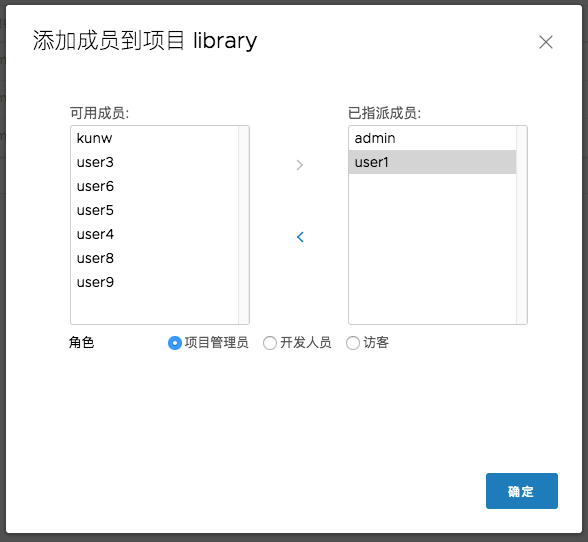
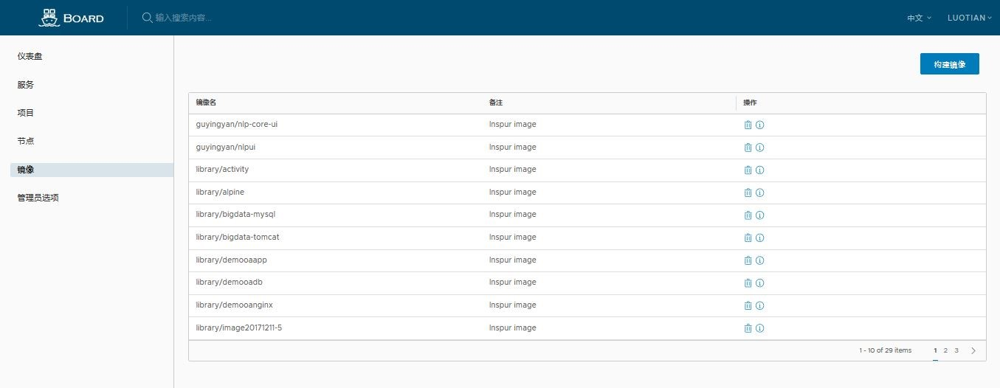
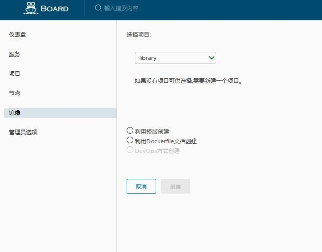
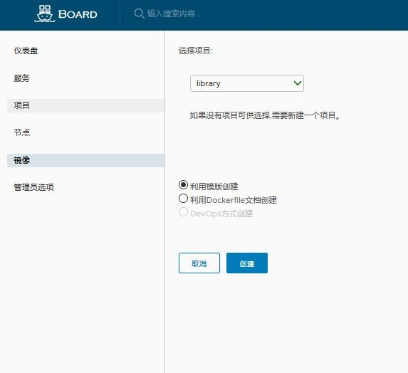
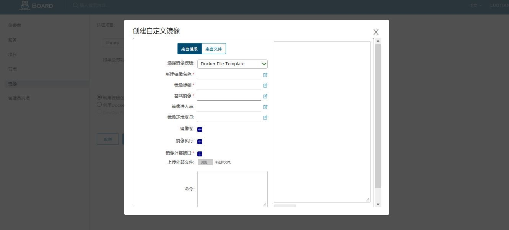
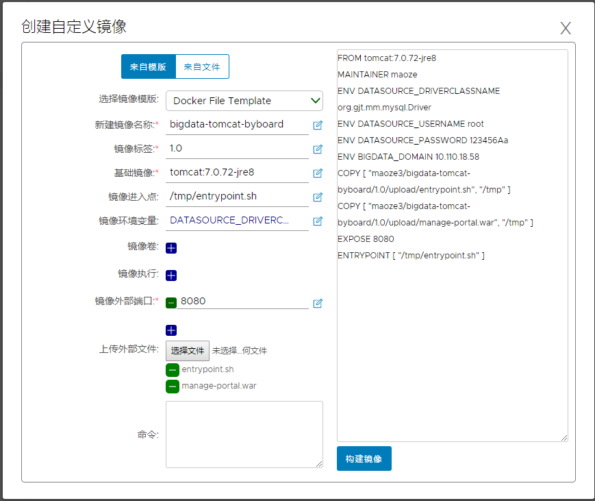
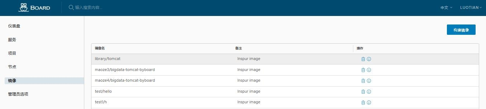

## 用户指南  
## 概要  
本指南介绍了浪潮容器云服务平台（Board）的基本功能，指导用户如何使用Board系统  

* 用户账户管理
* 基于角色的访问控制(RBAC)  
* 管理项目
* 管理项目的成员
* 管理镜像
* 管理服务
  * 构建服务的镜像
  * 构建服务
  * 部署服务
* 查找项目，服务，用户和镜像
* 监控仪表板
* 管理员选项
* 常见问题

## 用户账户管理
Board支持database认证模式，同时也支持LDAP模式 

* **基于数据库(db_auth)**  

    用户存储在本地数据库中。
	
    用户可以在此模式下自己注册。用户点击注册， 输入相关的信息即可注册属于自己的账户。
	
    如果需要禁用用户自注册功能，请参考初始配置安装指南，或者禁用管理员选项中的该特性。在禁用自注册时，系统管理员可以将用户添加到board中。
	
    在注册或添加新用户时，用户名和电子邮件必须在board系统中是唯一的， 如果新注册的用户名已经存在， 系统会提示该用户不可用， 请选择其他用户名。密码必须包含至少8个字符，包括1个小写字母、1个大写字母和1个数字字符。

    当您忘记您的密码时，您可以按照以下步骤重新设置密码(需要SMTP服务器支持):
  *   点击页面上的“忘记密码”链接
  *   输入您注册时输入的电子邮件地址，电子邮件将被发送到您的密码重置
  *   收到邮件后，点击邮件中的链接，将你导向一个密码重置网页	
  *   输入您的新密码并点击“保存”

* **基于LDAP (ldap_auth)**  

	在这种身份验证模式下，存储在外部LDAP或AD服务器中的用户可以直接登录board。系统默认为database模式， 如果需要使用LDAP模式，需要做必要的配置。配置方法参考配置手册。  
	
	当LDAP / AD用户以用户名和密码登录时，使用“LDAP搜索DN”和安装指南中描述的“LDAP搜索密码”来绑定到LDAP / AD服务器。如果成功，Board在LDAP条目“LDAP基本DN”中查找用户，包括substree。“LDAP uid”指定的属性(如uid、cn)用于将用户与用户名匹配。如果找到匹配，则将用户的密码通过绑定请求验证到LDAP / AD服务器。
	
	在LDAP / AD认证模式下，不支持自注册、更改密码和重新设置密码，因为用户是由LDAP或AD来管理的。

## 基于角色的访问控制(RBAC)  

通过容器服务平台上的项目管理服务。用户可作为具有3个不同角色的成员添加到一个服务中:

**访客:** 客户有公共项目和服务的只读特权。
	
**超级管理员：** admin, 拥有最高权限， 可以查看、修改、删除任何可操作权限。

**项目管理员:** 对自己创建的项目拥有修改， 删除， 查看等任何权限 ， 项目管理员可以添加其他人员到自己的项目当中，被添加的人员用户和项目管理员相同的权限。
	
除了上述三个角色之外，还有两个系统角色:

**系统管理员:** “系统管理员”具有最多的特权。除了上面提到的权限之外，“系统管理员”还可以列出所有项目，将普通用户设置为管理员，删除用户。公共项目“库”也由管理员拥有。

**匿名用户:** 当用户未登录时，用户被视为“匿名”用户。匿名用户无法访问私有项目，并且只能访问公共项目和服务。
 

## 管理项目
一个项目包含所有的服务，图片等。在board中有两种类型的项目，他们分别是公有项目和私有项目:

*  **公有:** 所有用户都拥有对公共项目的read权限，您可以通过这种方式共享一些服务或获得其他服务。
*  **私有:** 私有项目只有拥有适当特权的用户访问和使用。

您可以在登录后创建一个项目。检查“公共/私人”复选框将使这个项目公开。

在创建项目之后，您可以使用左侧的导航栏浏览服务、用户和镜像。

## 管理项目的成员
### 添加成员

您可以向现有项目添加不同成员， 被添加的成员拥有对该项目的读，写等权限。

### 更新和删除成员

您可以通过单击左箭头来更新或删除成员，以便在用户和成员列表的中间添加成员， 用户被删除后失去原有的权限。

### 改变成员的角色

你可以通过点击下面的角色单选按钮来改变成员的角色。

## 管理镜像

从左侧的镜像功能中，可以显示系统中的镜像列表

### 创建新镜像

点击创建镜像图标，选择镜像所属项目

### 选择镜像创建方式

提供三种方式创建镜像， 分别是“利用模板创建”、“利用Dockerfile文档创建”“DevOps方式创建”，在这里我们选择一种方式举例，利用模版创建：

### 配置新镜像

依照模板提示，可配置以下镜像选项：

*镜像名称
*镜像标签
*基础镜像
*镜像入口点
*镜像环境变量
*镜像存储卷
*镜像运行指令
*镜像服务端口
*外部文件上传

### 构建新镜像

开始构建新镜像

构建成功后，可以从镜像列表中看到新镜像

## 管理服务

Board支持创建容器服务。所有服务必须按项目分组。点击“创建服务”。

### 选择所属项目

第一步是选择一个项目。如果没有项目，请先创建项目。

### 选择镜像

“选择镜像”是构建服务的开始。

选择所需的镜像和它的镜像标签，如果需要，选择多个镜像。

### 配置容器

下一步是配置容器。

可以为这个服务的容器定制以下参数。
* Working Directory
* Volume Mounts
* ENV
* Container Port
* Commands

### 配置服务

点击下一步，进入配置服务。可以为该服务定制以下参数。

* Service Name
* Instance

在高级配置中，可以为外部服务分配节点端口。

配置完成点击下一步

### 部署服务

单击“Deploy”部署新服务。

在成功部署服务之后，用户可以从服务列表监视服务状态。如新创建的服务demoshowing5

### Examples to create services

#### Example inspur bigdata
Deploy a service "bigdata" which is a containerized project for the Inspur bigdata software platform.

* Start to create a service

* Select a project

* Add images for this service

* Select images for this service

* Select two images for this service

* Configure containers

* Configure storage volume for the mysql container

* Configure environment parameters

* Configure container ports

* Configure the bigdata service

* Configure the external node port

* Deploy the bigdata service

* The bigdata service is deployed

* Monitor the bigdata service status on Board

## 查询

搜索引擎可以搜索项目、服务、用户和镜像。

### 查询的分类

* **项目**:
用户可以通过一些限制搜索项目:

* 普通用户只能搜索这些项目，这些项目是他们共同的项目
* 系统管理员可以搜索所有的项目

* **服务**:
用户可以通过一些限制搜索服务: 

* 普通用户只能搜索服务服务的所有者,或属于同一项目。
* 系统管理员可以搜索所有的项目

* **用户**
可以使用一些约束来搜索用户: 

* 项目管理员可以搜索属于这个项目的用户。
* 系统管理员可以搜索所有用户

* **镜像**

* 普通用户只能搜索属于同一项目或普通图像的镜像。
* 系统管理员可以搜索所有的镜像

### 查询的结果
* **查询的结果** 如下所示

## 监控仪表板

监视仪表板从k8s主节点和节点收集日志。它涵盖了机器指标，如CPU、内存使用、文件系统和k8s服务运行时。

服务运行时收集所有服务并对应于pod和容器的标签。在仪表板中显示统计实时和平均数字
 

机器指示器收集所有节点的所有CPU和内存节点指示器
 

文件系统收集节点的所有存储指标
 

## 管理员选项

管理员选项提供用户管理，可由管理员用户添加、更改或删除用户。

* **注意**: 此选项只提供给用户系统管理员角色。

### 查看用户

这个列表显示所有注册用户。

* **注意**: 管理员用户是系统默认的第一个用户，不能被修改。

* 具有系统管理员角色的用户可以更改其他用户的权限。

### 管理用户

用户可以通过点击“添加用户”按钮创建。

用户可通过点击编辑按钮进行编辑

从列表删除用户。

## Q&A

